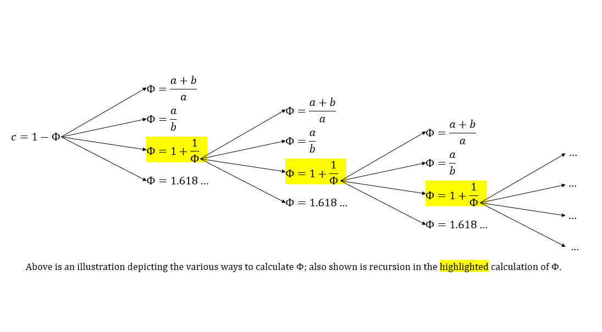

# whoami/whoareyou 

**Introduction**

The following, in six parts, is an attempt to answer the philosophically significant question 'Who am I?' by defining 'I' as a measurable unit in reality. The premise is: in order to answer anything from the philosophically perplexing to the physically insignificant, an 'I' -- that is, an individual, a 'someone', a body-- is necessary to be present before the self can respond with an answer to any question. By defining 'I', the self is grounded in reality by a definable value and, therefore, the self is equipped to answer 'Who am I?'

What are the properties that define the _self_? What also can be known based on this definiton? How do I live according to this definition of self? To answer these questions, I present propositional mathematics, concentrated philosophy, _living_ as art, and framing. The intention behind this document is to _know more_. In other words, what else can be known based on this knowledge? By defining the self as a value, we are able to observe the self as an _object in reality_ while also understanding the self as an _object of our own perception_. In the following, a proposition is given that the value of the _sense of self_ is the same value that is seen repeatedly across the universe in everything from spiral of a nautilus shell to the shape of the Milky Way galaxy to the length of your arm. This value is called the divine proportion, phi, or 1.618...

So, now that I have a method to understand my self, what does it mean that I am here? In other words, I have foundational knowledge in the fact of my existence because I have the ability to define my self as a value and so, what does it tell me about my self at present? A desert island thought experiment is used to reach conclusions about life, mortality, choice, and time. 

How can my sense of self find the golden ratio? Truth is necessary and honesty is an imperitive in the framework desribed in _living as art._ An approach to defining the ideal self through self expression is defined in _living as art_. Lastly, 'framing' is desribed as an approach that is aimed at deciphering and integrating the truth that is available in the present moment (i.e. Who am I? What am I? How did I get here? What am I doing?).

I begin by defining some terms, asking some questions, and sharing a bit of my story. The subject of truth is desribed as the quintessential element that binds humanity to all things in reality. Humankind seeks truth. As a species, we are driven onwards by our perpetual quest for truth. And truths can observed, or known, or understood, or believed. No matter what, though, truth is _real_. But what is the truthful answer to 'Who am I?' Truth is a foundational aspect of reality and perception, so defining the truth about _what the self is_ is critical to deeper understanding of the physical realm and in the abstract thought. I tell my story about my history of addiciton and abuse and mental illness.

I use a unique philosophical proposition, based on objective facts, that assigns the value of the Golden Ratio (1.618..., or ϕ) to the sense of self. With this value, I make an additional proposition that the 'identity' is akin to a fractal set, specifically the Filled Julia Set. Using the Julia set function (fc, c = 1 - ϕ), _meaning_ can be derived from iterations of the function as it relates to the self and existence, life and death, and identity as the expression of the self.

Based on the 'identity equations', as I refer to them, I present philosophical conclusions stemming from the classic desert island thought experiment. I refer to the experiment as The Isle[0], and the conclusions are related to time, mortality, and reality. The judgement that 'Life is good.' is also presented and a case for individual imperitives is given (in development).

Lastly, a thought framework and personal credo is described in detail that aligns with the conslusions from propositional mathematics and concentrated philosophy. This section desribes the means and methods for identifying the ideal self, or who we _want_ to be and _how_ we want to be. I provide a sample of self-organization and also relate some peronsal anecdotes.

The contents of this document ideally will flow from a (1) description of some of my life events, which prompt the question 'Who am I?' and 'What next?' (2) to a philosophical/metaphysical foundation for self and then (3) to a thought framework and method to reach the ideal, whatever that may be. The goal of this endeavor is to relate truth as I have come to understand it about the self, identity, and its place in reality. Each of us observes and perceives truth in reality and, therefore, it is critically important that the self also has a method to define and understand truth. The 'identity equations' give form to truth about the self.

**Observer effect (physics)**

In physics, the observer effect is the disturbance of an observed system by the act of observation.

**Emanation Theory** (by Asante James Knowles)

Emergence is a hot new term in disciplines ranging from philosophy to neuroscience. Emergence asserts that whole entities are produced by the organization of their constituent parts but are not inherently the same as the parts. The concern with emergence is it does not explain how parts become a whole or become something greater than the whole. The way parts become a whole, or something greater than the whole is when the parts obtain a function. Before we go into the nature of functions there is further that needs to be noted about emergence. The other concern with emergence, is it does not consider the fact that parts are themselves whole(s), that also obtain their own respective function. Parts are wholes, and wholes are also parts of other wholes. Acceptance of this dynamic can lead to an infinite reduction of physicalism. The scales become broken when you fall into these reduction pits. The solution is not mere emergence because emergence does not account for or explain fundamentality nor functionality. The simple solution to solving the dynamics of parts, wholes, and things greater is considering that functions themselves are fundamental, and that they transverse scales and degrees. The reason we should consider functions as fundamental is because no matter if we observe physical, psychological, or informational objects there is no way to separate the identity of the object from the whole function that the identity is upholding. Just how you cannot separate the entire information of what said object is from what the object essentially is. Arguments can be made that an object’s form is the object's essential identity. However, form in itself, (synonymous with essentially) is a function of other parts. Function is irreducible and it traverses scales which makes it fundamental, dynamic, and whole. This entails that true functionalism is naturalism. Evidence of this is by natural functions exhibiting self-referential, self-organizing, and self-transfiguring processes.
					
Now onto functions. The most practical way to describe a function is a process or flow of information from its source (i.e., its initiation) to its form and then the information proceeds as interaction with its environment, itself, and its constituents; in either a causal or non-causal continuum. When the information flow is causal, the function produces a subsequent function (I.e., an effect). This is called Emergence. When the information flow is non-causal the function conditions itself as a subsequent function (I.e., self-referential process). This is called Emanation

Emanation theory claims that memories are non-causal reflexive interactions of information flow. Experience is the first memory to emanate from existence. The condition of existence and experience entanglement is the initial condition of self-referential flow from any fundamental information system or source.

**Perceiver Effect and the Perception Constant**

The bodied self is a form functioning. Our bodies are the culmination of innumerable partial and distinct forms and functions. We can taste, smell, touch, see, and hear. Our eyes, each eye, is a beautiful refinement of evolution. The dexterity and precision of our hands and the keen ear or the discerning nose. It’s all connected by a system of constituent parts and those parts grow and change over time. These parts in you assemble to create your self. And you are more than just your body. You are the function within your form choosing your function. You are perception perceiving and defining itself in reality.
The perceiver effect is the fact that the memory of an observable experience is disturbed by the act of perception at the time of the experience. The self is distinct from any experience, but it's perception of an experience is singular in memory. The perception constant is a way to define the self and account for perception in observation.

Humans are the observers of that which is and that which is not, yet. No matter what, we are where we are and that is observable and self-evident. We observe time as it passes, and we catalog those experiences for ourselves over the course of our lives.
But, observation is passive – how can I be an active participant in my reality? In other words, how do I respond to the present and change my experience? It all starts with observation.

In physics, the observer effect is the disturbance of an observed system by the act of observation. An especially unusual version of the observer effect occurs in quantum mechanics, as best demonstrated by the double-slit experiment.

What is observed in the experiment is liquid time cloaking a particle, emanating a wave as the fluid washes around the particle. The wave and its wake is the particle's imprint of where its been and what it has altered in the flow of time.

In a world where observation (via the observing self) changes the observable, we must account for perception in measurement. What if perception (via observation) is the mechanism that changes the wave or particle in the double-slit experiment?

What is the value of consciousness? It is essential to all things. Gravity, light, and even Planck. The unifying element is that there is someone present to experience it, observe it, define it, and understand it. Whatever it is. Someone must be there to perceive it. And each of us, over the course of our entire lives, experience the constant and continuous stream that is the sense of self.

How can you define anything in metaphysics (like whether what is being observed is a wave or a particle) without first quantifying the thing in reality that is perceiving another thing in reality (i.e. a wave or a particle). And the self is present in reality as a body.

This reminds me of how biophysicist/psychologist Peter Levine describes the mind-body connection, which is a description of how the self exists in reality. He says that the 'body is a container of self'.

A wonderfully empowering statement. It's like, my body is the cup and it's filled to the brim with self.

In the following, self-expression is described as a means to externalize the sense of self. And self-expression has many forms. It is the will to know, do, act, believe. So, I say that the body is an instrument of self. The will that knows, does, acts, and believes. In this way, the body is like a pencil to paper or a chisel to wood. A tool to be used by the mind to respond to a given present reality.

The self defines its ends in the ways that it responds to all things and, the ends is defined by the means by which it was achieved. The self is to its ends as the end is to its means.

## INDEX

**Part 0: The Complexity of Now**
* 0a: Complexity
* 0b: Definitions
* 0c: Five Facts about 'I' and 'Now'
* 0d: What's next?
* 0e: Where are you going? To what end?
* 0f: Rules
* 0g: Capturing Complexity

**Part 1: What am 'I'?**
* 1a: A Method for Knowing and Understanding the self
* 1b: The Duality of Self
* 1c: A Formula for Identity
* 1d: Exercising Free Will
* 1e: The Golden Ratio
* 1f: The Property of Truth
* 1g: Concepts
* 1h: Propositions, _meaning_ from Fractal Set calculations, & "I" AS IT EXISTS IN REAL-TIME

**Part 2: What constitutes 'I'?**
* 2a: Overview & Purpose
* 2b: Universal Truth, or Common Good
* 2c: The Isle[0]
* 2d: Conclusions about Life 
* 2e: Conclusions about Choice
* 2f: Conclusions about Time
* 2g: A Conversation with Death
* 2h: Oneness and the Eternal Present

**Part 3: Life is good.**
* 0a: Five Facts about 'me' and 'now'
* Health (post-alcohol/respect for body, future)
* Family (Support, care)
* Love (audrey,grant,ronan, simple joy of life)
* Methods of Expression ('making', computers, tools, art)
* Inequality is the source of imbalance. How do I neutralize extremes, find balance in life and improve my position? Seek 1.618.... (life is so rich and joy is bountiful. Consider two courses of action that are achieveable, definable, and respectful. Using the properties of the golden ratio, assign the larger/greater/self-interested/positive option as _a_ and the other option as _b_. Choose _a_ and orient yourself towards 1.618...)

**Part 4: How is identity defined?**
* 4a: Overview and Purpose
* 4b: Existential Calm and the Isle[0]
* 4c: Self-Expression and Externalization
* 4d: Oneness
* 4e: Questions for Self
* 4f: Living as Art
* 4g-4n: //in development

**Part 5: How to be intentional?**
* 5a: Framing the World
* 5b: A Method to Find Truth
* 5c: Propositional Mathematics
* 5d: Definitions
* 5e: Concentrated Philosophy
* 5f: Living as Art

# Part 0: The Complexity of Now

## Complexity

Why?

Why is it like this?

Why isn't that like this? 

Can it be different? 

The complexity of each moment is found in the answers to questions like these. Asking _why_ is an interrogation of reason, of cause, and of source. The object of _why_ can be anything. Why am I here? Why are you? Why, why, why?

Asking _why_ is like plucking at a string on a guitar. The interrogative resonates an answer. Listen to the sound and forget the question. 

Why am I me?

_Because someone has to be._

#### What is the source of truth?

Self-discovery is the path to truth. It is the path to understand the self, communicate truth, know nature, and feel the divine. Self-knowledge comes from self-discovery.

Truth is the end and the beginning of all things. Truth is what is real and factual and congruent with reality. It is indeliable and permanent and resists the trammels of time. It is reliable and understandable and observable. It aligns all the metaphysical puzzle peices that comprise our ability to perceive. Truth is valuable because it is a light in the dark.

Follow the path seeking the end. Truth is the highest outcome. A good Samaritan with the honest truth sharing the path of life.

The bodied self is truth embodied. The highest outcome of the living self is truth. Living is good. Living for truth is better.

The self is the source of truth because ‘truth’ is a concept that is used to define a property of some _thing_, some _object in reality_.

We are and I am. We define truths together and alone, to one another and ourselves.

There is beauty in truth. For the self, it makes the ripples and waves of memories placid, so that the mind can perceive the subtle and beautiful.

I was lost amid my own mind for many years. I did not know who I was or how to be my self. How could I be ‘me’ if I did not know what ‘me’ is? I didn’t understand my self, so I relied on mimicry and reflection to define myself. In other words, I didn’t know how to be myself so I integrated or imitated the behaviors of others to my own purposes. 

I did not know my self so I did not know truth. If you don’t know truth in your own self, you will be unable to know the truth that exists in others. If you don’t know truth in your self, you will be identityless.

I was identityless so I quantified and defined my identity so that I could create one that is wholly my own. The key to creating your own identity is in the variable answers that you use to understand your self and communicate your self to others.

A boat can float and it can sink. Whether it is the gentle wearing of time upon the boards or the trials of rough seas, a boat on the water will sink eventually. The boat’s resilience to the slow arts of time and its determination in the midst of heavy seas is how it remains afloat. The worth of a boat is measured by its ability to float in spite of circumstance.

_Be the unsinkable ship._

## (#) Definitions

### (1) Now, a _noun_;

'Now' is a stream of consciousness, a continuous flow of stimuli that you intepret and internalize as memories. Your mind translates everything around you into memory.

The complexity of now relies on someone being present to experience it. 'Someone' will always have an identity and a sense of self. Identity is the observable expression of the sense of self each person has.

### (2) Here, a _noun_;
'This' place. The things around you that you can touch and see and feel and sense. Here is the place that you find yourself in at all times. You are 'here' because your body is here and your mind is present to respond to it. To do the dishes in the sink or comfort a friend in need. You are here because its unavoidable. You exist.

### (3) To exist, a _verb_; existence, a _noun_;

I doubt, I think, therefore I am, because I exist. Existence is a fascinating topic. There are some that might ask, 'Why? Who cares? Its implied in all things, so why does it merit discussion in the first place?' I understand the skepticism, 'existence' has so much finality associated with it. But, it _is_. It is simple and unifying. Everything exists. This book. Your eyes, reading this. Its all real. So, _'this' around us_ is the sum total of what has existed, because everything that _will ever_ happen _will_ proceed from the past. We are like boats riding the opening salvo of _liquid time_, which burst forth like floodgates releasing a river that flows on forever. Existence is simply a foundational truth, so foundational that it is easily overlooked. It denotes a binary state. You either exist or you don't. Do you exist? I will always tell you that I exist. It is foundational element of who I am because _existing_ is a source of truth in my life. It has always been true that I exist, and I intend to exist for the rest of my life. The simplest truth that 'I exist' is the pillar upon which the sense of self is built.  _My 'I'_ and your 'I' and our neighbor's 'I'. Its the person in your shoes, and the pair of shoes next to you. But, what is a sense of self? Can it be observed and defined? The self is the internal perception of and relation to the present each and every one us possesses. Our 'I'. This 'thing' is capable of knowing and understanding and remembering and creating. And what are the limits of perception when its in unison with reality? Each 'self' determines the identity that it manifests in reality as self-expression. This truth that 'I exist' also serves as a benchmark for other, more complex truths. But, is the truth _real_? In other words, does it exist _like me_? Can I observe something real to confirm it? Truth is that which is true or in accordance with fact or reality. Truth can also be a belief that is accepted as true. So, when I _know_ that I _exist_, it means that I will also to confirm some aspect of truth about my reality. I can waive my arms in the air. I can skip that day at the gym because I forgot fresh socks. We make choices and do things. We are a unit in reality that is aware of itself. Great, so what? I know I exist and I also know that rent is due, whats the point? Well, its important because it means that _truth_ is both perceived and defined by the self. And, at minimum, I can define the truth about my self and my idenity. So, who am I (1,  a thing in reality)? What is 'I' (ϕ, this thing that perceives reality)? How does 'I' (1/ϕ, this thing that interacts with reality) manifest in reality? How does it perceive? What does it mean that I can perceive the reality that I exist in? How does this inform my approach to living in reality?

In order to be aware of any truth in existence, the self ('I') must be able to perceive the reality that the self ('I') exists and is made real through self-expression. In this way, the self is the unification of perception and reality. So what? I know _the truth that I exist_, where does that get me? Well, you have a thing in reality that perceives its existence and knows/understands what truth is. The autonomy of self must decide what their relationship with truth is like. I believe truth to be the highest outcome in all things. Truth is ubiquitous and all encompassing. It is hidden and revealed and mined by perception to the depths of inquiry. Truth connects our minds with reality. It connects other things in reality. It can connect others as a network of truths. A truth is a truth, so who could compare them? Either possesses the property of truth and are in accord with reality. What is more real? Personal truth or observable truth? Both truths are real, aren't they? Yes, and its because the self, _this_ perceiver of the truth, exists.

### (4) Living, a _noun_; to live, a _verb_;
What is 'living'? How to live? Living is a persistent state of being, a state that requires a response to stimuli at all times. The manner in which the self responds to a stimulus at the present moment is ultimately an opportunity to meet the ideal self. But, what is 'ideal'? The _ideal_ is ultimately a choice that must be made by the self that attributes a value to a thought pattern or an action through time invested. Personally, I like woodworking. I like the precision, the tools, the practical and creative opportunities. Some people like family, cars, computers, board games, all sorts of things. The point is that its all about time, and a special type of time. This particular type of time is perception, which is summary of time between the entrance and the exit of existence. Time has value and we transfer that value to the things we care about through our individual thoughts and actions. At each opportunity to act, therefore, the self must choose _how_ to act. How to be good? How to be true? How to be The Good Samaritan with the honest truth? The ideals of good and truth in thoughts and actions is like using intention to change reality. Good, Truth. The various means by which the self is externalized (i.e. self expression) that occur over a lifetime represent the identity of the self.

Living with complexity means that, not only is the self asking 'Is this the ideal?' at every opporunity, but also its will is threatened to be overcome by an irrational, persistent need. Addiction, trauma, and contradictory thought patterns will disrupt the self's ability to respond adequately in real-time. In such circumstance, an individual is experiencing intrusive thoughts that deviate the self along the path to the ideal.

### (5) Form, a _noun_;
The self is the inside of the shell and the outside of the shell. Function due to form.

The body will always have a sense of self because the physical form of a body necessitates the presence of a sense of self. A unique body will generate a distinct sense of self to fill the shell. The body is the shell from which each and every individual's sense of self is poured out into the world. So, 'how do you express your 'self' into the world?' becomes an important question.

The body is also the shell in which the liquidity of 'self' is held. I know I am but, who am I? And, what is 'I'? How do I perceive and define my 'self'? The body as a shell, then, is rising to fullness with the liquidity of self. The individual identity is a product of the 'self' and persists through time as memory. 

### (4) Truth, a _noun_;
The truth unites perception and reality. _What is real_ is the input into _what is perceived_. When perception reflects the truth in reality, the self defines 'truth'/'being truthful' to be the highest outcome for the self. Perception will harmonize with reality upon truth and, the simple and observable truths are often the most useful. These truths are repeatable thought patterns in the way we perceive and are demonstrated through reality. 

An example of a universal truth about _the self_ is that they all share in hope. We hope alone and against all odds, or together as a tribe or a nation or a world. Each and every one of us lives with a hope, a core and internalized ideal. Hope will spurn the individual onwards through labor, toil, and strife. Hope is powerful. Hope will never let you sink when your expectation is to float down the river at the bidding of the current. We are floating on liquid time.

### End of Definitions

For now...

## Five Facts about 'I' (self as subject) and 'Now'

1. I exist.
2. I exist here.
3. I exist now.
4. I am alive now.
5. I am mortal here.

## What's next?

So I know that I am alive here and now, what do I do next? I am a living being and I have senses at this moment. I can wiggle my toes and scrunch up my nose. What's interesting is the connection between your brain and your toes or your nose while your wiggle or scrunch. Think about the action involved with either. Its simple, right? You think about your toes or your nose and it just happens. Yep, but it is something special. The simplicity of it all belies the truth about whats happening in your body and mind. The intricacies of your nervous system are responding to how your mind perceives the present moment. The body and the mind are unitary, they are the two components of singular existence. And, singular existence is selfhood, or the individual identity as it exists at present. You must have a body in order to exist and you must have a mind in order to perceive that you exist.

I am here at this point in my life, which is observable. You experienced birth and growth. You are alive now. You also know that someday, you will end. When you reach that fullness of life and you finally exit the world, the present ceases and whats it left are all the moments of your life. The present is the foremost in a sequence of observable events as time progresses. For example, the observation supporting the perception of _being at the grocery_ is to be, in fact, at the grocery store.

## Where are you going? To what end?

__Veritatis, iterum.__

_For truth, once again._ is a good reason to do anything. Follow truth wherever it takes you and you will not be surprised where you end up. Truth in a sequence always makes sense.

Truth in reality is observed, truth in mind is perceived. Truth unites perception and reality. It is measureable. We, as humans, exist to know and understand truth. The truth in reality will calm a truthful mind. Truth is a property of all things because all things are capable of being truthful as elements in reality. So, whether it is a truth discovered beneath the lens a microsocope or at the deeps of a sudden plunge into thought is irrelevant, the fact will always remain that both the lens of the microscope and your mind exist. Truth _unites_ precisely because it is in accord with reality.

A mind that _seeks truth in all things_ will also share in truth and, thus, be in unison with reality. The _here and now_, or 'this' place and my perception. Truth is recognizable precisely because it is discernible. How to discern truth? The answers to that question are many and diverse. However, I can tell you what truth is like. Truth is like a shadow. Finite and definitive at the edges but obscured and ubiqutitous at its interior. Ok, so how do you discover the nature of a shadow? You can watch it move across a wide, grassy field. You can observe its shape as it glides over the ground. You can see two wings. Are they moving? Whose shadow is it? 

If the wings move, it is a bird. You can see the shadow of the bird moving gracefully across the open space before you. The bird is soaring with bright sunlight on its wings. As the wings bend with every flap, the shadow _changes_.

If the wings don't move, it is a plane. You can now see the shadow of the single engine cruising across the open space as it passes by overhead. The same sunlight hits the top of the wings thats casts the shape of wings, wheels, propeller on the grass before you. As the sharp lines of the wings maintain their shape, the shadow _remains the same_.

I observe the silhouettes of truth at the exterior to understand more complex truths at the interior. Or, I rely on the simple truths to know complex truths because truth is consistent with truth.

The self makes truth real.

## Capturing the Complexity of the Present ('Now')

### 06/16/2021 ~20:00

*He stood silent in front of his chair in his garage. The low light from the lightbulb behind him cast a long shadow across the floor to the front of the garage, where a shelf with paint cans was located. On the second shelf from the top, stood three cans. They hadn't moved in months. A can of grey spray paint with the words "PRIMER 2x" was next to two stout cans stacked on top of each other. The can on top was the shorter of the two and said "Finishing Paste" in black across a bright yellow background. The lower can was also yellow, and read in big letters across the front "Wood Stain".*

*He knew these three cans well. He has been watching them from his chair for nearly a year as he sat, and stretched, and listened to music, and considered the questions he had. The can of "Primer 2x" captured his attention first. The labor and toil of his life and its effect on his body had been a primer for his future. The steadfast resilience and determined courage primed him to live and to be. The can of "Wood Stain" was next. His focus was on the word "Wood" but he only ever saw the word "Good." He had been primed to live and he considered, now, how to be good. He watched the can and he stretched and listened and learned that "Life is good" and to be good, he must reflect it truthfully. The final can, the "Finishing Paste", was an endeavor into his own mind to determine how he could continue to live his life and reflect anew his mind and express it meaningfully as good and truthful.*

*Primer, good stain, and finishing paste. The finished state found him slumped in his chair motionless. A moment before, he was standing and stretching. He had traced his body with his left thumb from the bottom of his right heel, up the back of his legs, along his spine to finally reach his neck just below the left side of his face. When he dragged his thumb from left to right, there was a small pop, he fell into his chair, and was unconscious for a few moments. He felt as though his entire body was in some time of slipstream, a complete reconfiguration and recalibration of his body and his mind. His mind was screaming, "Stand up!" So he stood up and put weight on his right heel.*

*This was the culmination of months of stretching and tracing, and happened only after he had discovered the truth. Life is good.*

Someone else wrote the above for me on June 16, 2021 around 8:00 PM EST. My name is Cullen Drummey and I am acquainted with complexity. About six months before this was written, I asked myself, "Who am I?". I asked this question in particular because it seemed to me that all at once I found myself in the midst of courses of time, adrift amid the contest of life. I knew my narrative, but it lacked substance. I could not recall specific details about my childhood, adolesence, and early adulthood. I knew that I had, in the last 5 years, sobered up, got a graduate degree, got married, had a kid, pivoted to a new career, and experienced a slew of mental health crises of varying degree. I have always struggled with mental health problems and the cumulutive effects of a lifetime of self-loathing and self-destruction resulted in a major event after I had been sober for a few years.

I was overcome and lost and I broke down. I didn't know how to answer simple questions about myself and I was disoriented at how I had arrived where I found myself. I spent months in a daze, entirely focused on my internal dialogue and trying to make sense of what had happened in my life and how I could reconcile where I was at present. I was exhausted, occaisionally manic, depressed, extremely anxious, and I had begun to pick at sores on my face. I continued in this way for many months and at this time I was rude and unpredictable and prone to bouts of myopic focus and literal intepretation of speech. My wife considered separating from me and only after trying every approach possible to get through to me. She is a font of forgiveness and love and honesty, and I love her dearly for it.

In J.R.R. Tolkien's _The Silmarillion_, which chronicles the creation and history of the fantasy realm he created, the elves appeared on middle-earth when they 'awoke' on the shores of a clear lake beneath a deep and starry night. The elves were bewildered and speechless at the perfection of their surroudings, and wandered the wilderness until, one day, they encountered the light. As I mentioned, I was on the heels of a significant mental health crisis which damaged my marriage, my health, and my professional life. I had spent nearly the last two years with some degree of visible self-mutilation and persistent body tension as well as a prolonged demeanor characterized by cynicism and irritibility. As these symptoms receded, I found myself in a small town on the Eastern Shore of Maryland called Easton. I was in a beautiful, square brick house. I had a wife and she was pregnant. I had a son and he was about to turn two years old. I was a software engineer at the world's largest aerospace and defense manufacturer. But I didn't know how to discover the truth about myself, who _I_ was. I was thirty-one years old.

My recollection of my past is limited and the things that I do remember are painful. I suspect I was sexually abused as a child based on intrusive and reccurrent memories, but I can't be sure. Memory is complex. I know that I spent adolescence into my early mid-twenties as a consummate alcoholic with a proclivity for wreckless and crass behavior. I have two scars on the inside of my forearms from self-harm at an early age, which are a reminder of the times I tried to commit suicide later in life. I remember attempting to die twice, and it took a long time to forgive myself for those times.

I reject those things I did as answers to the question "Who am I?" I have accomplished so much in my life, despite the terrible baggage that I carried with me. My beautiful, forgiving, loving, and brilliant wife showed me how to be better. She showed me how to pick yourself up after desparate and disheartening times and carry on with renewed vigor and lust for life. My sons and the gentle and simple joys of their childhood has shown me that life is always worth living because there is always more life to live.

I say that someone else wrote the passage above for me because before I reread the passage, I didn't remember the event or writing the words. The story is true, because I can recall now the chair I built and the corner its in in my garage. The paint cans are still on the shelf, undisturbed. I remember feeling like I was paralyzed as I fell into the chair. I remember stretching and tracing my body because I had been doing it for years. But who was that someone? And why did he believe 'Life is good'? And how do I know it's not me?

## Rules // in dev

**Golden Rule:**
Treat others the way you want to be treated.

**Enduring Rule:**
Treat yourself the way you want to be treated by others.

Identity is real. It can be lost and it can be found. It can be restored.

**Story: **
Sorrow into wisdom, follow the path of truth

By reflecting what is truthful, you follow the path of truth. the truth flows on until the end.

truth is the highest outcome for the self.

Trust is influential. Belief is trust in something without full assurance. When you trust, you open your self up to influence from the object of trust. An object of trust can be someone you grant trust to or something believe is trustworthy. If you grant your trust to someone, it means that you value their perceptions. If trust in a belief, it means that you value the object of trust to such a degree, you allow it to influence you.

Trust obscures truth. When you trust someone or some thing to the highest degree, the influence from the object of trust is mistaken for truth. The sense of self needs truth in order to be proportional (maintain the ideal).

A child will trust a parent to the highest degree and believe their word to be truthful until that trust is broken. If the parent is flippant and contradictory, the sense of self of the child will become skewed because the child lacks fundamental truths to build their sense of self upon

Joy in the deed of making and in the thing made is where I took consolation because I had made something new and entirely mine.

i[1]
a: I am what I am
b: I do

Until about 3 years ago, I was in a mental and behavioral battle with myself. I had to find a way to live in a world that had made me want to die.

I had to find a reason to live and I had to act in accord with what I wanted that life to be like.

# Part 1: What is 'someone'?

## A Method for _Knowing_ and _Understanding_ the self

The _mind_, the thing behind between your eyes that can conceptualize itself and can respond to the world, is like an algorithm in that takes an input, any input from its surroundings, and releases an output. This 'thing', then, can be thought of as a computer program that receives and responds based upon stored data, like memories and experiences. As a computer program, this 'thing' must also perform a function, in other words, it must _do something_. So, our identity, the thing that makes this 'thing' unique is like a hashing function, in that, the inputs are distinct for each individual and finite for the self. For example, only _you_ experienced that difficult period in your life, and that experience will also affect how you live the rest of your life in your response to other, similar or paralell, circumstances.

For this analogy to work, the _mind_ must also have a value. The inputs into the _mind_ are ultimately memories of distinct experiences, like stored data in a database. Our memories are stream of experiences that compound one upon the other over the course of our lives. From the day we are born until the day we reach the fullness of our life, we are creating new memories on new experiences. What, then, is the value of 'self'? What is the value of 'self-expression'? 

## The Duality of Self

The duality of self begins with the creation of an internal world (the self) amidst an external one (reality). We live our lives everyday balancing ourselves between what we _think_ is happening and what is, in fact, happening. We are ever present in our pursuit to reconcile our perception of reality with reality itself. Truth unites perception and reality and so, when the self idealizes truth, the self is ever present and in unison with reality.

There is endless depth and beauty in the world around us while, at the same time, there exists great power and value in the mind of the individual in reality.

## A Formula for Identity

An identity is one of a kind. An identity belongs to itself. An identity is the testimony of the sense of self. *Who we are* are the things that we value in our lives and, most often, these things are the qualities, beliefs, and ideals that we model our selves after in our day to day interactions. As each life extends from the first days across the intervening years to the final moments, we are expressing our selves through our identities in the words we choose and the actions we decide to take. In this way, identity is the highest means of self-expression and self-expression is a reflection of our inner most self. 

How can you understand your self without understanding what your identity is? _Identity is your composition, the combination of your distinct experiences and unique perspcetive on life._

Everyone possesses an identity. Everyone has a distinct identity. In software development, an identity is a unique identifier assign to a single record in a database. This identity cannot be duplicated or copied and solely exists to identify a single record. 

## Exercising Free Will

Does this mean that you will always respond the same way to similar situations? Does this mean that I will not grow and change and right the wrongs of my past?

No, and free will is that choice that is made to do it differently next time. To change, to learn and grow from experience is an exercise in free will. The self acts willfully when it decides to modify its response based on past experiences. For example, an alcoholic's 'self' is impeded and disrupted by the desire for alcohol. A sober alcoholic has committed to themselves that they will no longer imbibe. A decision to live differently than how one has lived in the past and to ignore and control desire.

## The Golden Ratio

### Who cares?

I'll tell _you_ because it concerns you, as well. It is a very special number for two reasons. First, it is a ratio that represents a specific proporition of one thing to another, related thing. Two quantities of something --anything-- like the number of petals on a flower or the distance between your hand and your arm are in the golden ratio if their ratio is the same as the ratio of their sum to the larger of the two quantities. This number is extraordinarily useful in mathematics, architecture, art and more. It is a pattern that is often found in nature. The pattern of the seeds in a sunflower, the number of arms on a starfish, the shape of a hurricane and yes, even you in your body, represent the golden ratio in some manner. The measurement from the navel to the floor and the top of the head to the navel is the golden ratio.

You should care about the golden ratio because it so common. Its natural. It is part of the fabric of our reality. Its this funky little number that guides natural processes and perfects the evolution of life. The nautilus' shell is beautiful and ideal for its survival in nature. This shell is ultimately the result of refined genetics from generations of cephalopods that have resisted the forces of nature through the long forgotten eons. Its natural, and often observable. Could it be that humanity, as the most advanced species on the planet, also have a 'shell'? 

### What is it?

The "golden ratio" refers to a mathematical relationship between two numbers that is observable when the ratio of the sum of the numbers (a+b) divided by the larger number (a) is equal to the ratio of the larger number divided by the smaller number (a/b).The golden ratio is approximately 1.618, and represented by the Greek letter phi, ϕ.

The golden ratio can be approximated using the Fibonacci numbers, which are numbers in a sequential, never-ending pattern that begins with 0 and 1, and continues infinitely by adding the previous two numbers. For example, the sequence [0,1,1,2,3,5] represents the first six numbers in the sequence and the pattern is seen in the fact that the sum of the first two numbers (0,1) equal the third number (1). The pattern continues in that the sum of the second and third numbers (1, 1) equal the fourth number (2) and so on.

As the the numbers in the Fibonacci sequence increase, the ratio of any two sequential numbers approach the golden ratio. To put it differently, the higher the Fibonacci numbers are in the sequence, the closer their ratio is to 1.618. As shown below, the quotient of 89 and 144 is much closer to the golden ratio that the quotient of 2 and 1, which are much lower in the Fibonacci sequence. 

                    2/1 = 2
                    3/2 = 1.5
                    5/3 = 1.666666...
                    ...
                    144/89 = 1.61797752809
                    ...
                    4181/2584 = 1.61803405573

Also called the "divine proportion," the golden ratio is frequently displayed in the natural world. A common example is the golden spiral, which is a logarithmic spiral whose growth factor is ϕ and is a self-similar spiral curve the is observable in things like seashells, hurricanes, and spiral galaxies. Furthermore, the number of petals on a flower or the sides of an unpeeled banana will often be Fibonacci numbers and the pine cones twist in opposing spirals of Fibonacci numbers.

### Examples in Nature

The natural world is chaotic and unpredictable but, as a physical realm, it is organized and bound by the laws of mathematics. A fundamental way in which mathematics manifests itself in physical phenomenon is through the golden ratio. Natural processes like the spiraling of a galaxy or the revolution of a hurricane exhibit the same logarithmic spirals found in the golden spiral. Numbers in the Fibonacci sequence and the golden spiral are also observabled in various life forms that have evolved on Earth such as the number of petals on flowers or in the length and number of the arms on a starfish.

These things on display are complex, old, and natural. The golden ratio is a fundamental part of our physical realm and is a guiding influence on animate/inanimate objects in the world.

The golden ratio is exhibited in the forms of:

* Flowers & trees
* Hurricanes & Galaxies
* Human body

### Examples in Humans

The discovery of the golden ratio and examples in human endeavors. 

What is more complex than humans? Humans are a product of evolution in nature and are, therefore, natural beings with a chronology that is intertwined with the natural world. The human form exhibits the golden ratio in the face and in the  extremities. 

What is more complex than the human mind? 

The human mind can comprehend, understand and communicate the furthest intricacies of the universe. Could it be that the complexity of the human mind can be decoded using the golden ratio? It stands to reason that the human mind would also follow the golden ratio.

An economy is the output of the choices made by its constituents on buying and selling. Econmy is ultimately a human endeavor.

The golden ratio and the Fibonacci sequence are popularly used to analyze the economic performance. Technical analyst in the financial industry will use four applications of the Fibonacci sequence to analyze the historical performance of one investment or another to predict buying and selling trends. The four applications are retracements, arcs, fans, and time zones and are commonly displayed as data charts. Each approach uses the Fibonacci sequence to analyze the performance of a certain investment and make predictions about the investment's future. 

Technical analysts also use the golden ratio, most often as three percentages of key Fibonacci numbers: 38.2%, 50%, and 61.8%.

Even the human body is subject to the gold ratio, the proportions of the length of the nose, the position of the eyes and the length of the chin, are believed to conform to some aspect of the Golden Ratio. According to evolutionary research, physical attraction depends on ratio and, in particular, symmetry in facial structure. Our attraction to another person's body increases if that body is symmetrical and in proportion. Likewise, if a face is in proportion, we are more likely to notice it and find it beautiful.

Scientists believe that we perceive proportional bodies to be more healthy.

## The Property of Truth

### What is the value of truth?

Solve for x:

_The bodied (1) self (phi) is (=) truth (x) embodied (1)._

The body is the real thing that tethers the self to reality. Self is express through the body, and truth is the ideal expression.

### What is the ratio of truths?

The ratio of truths is the proportion of how we perceive a truth and how it is defined in reality. For example, perception gives an individual the ability to be conscious of the simple truth that the sun rises in the morning. Everday this truth is redfined and, fortunately for us, the sun continues to rise and set. If, however, one day the sun did not rise while the perception that it would rise remained, the value of the perceived truth would be 0 because the reality of the event is 0. Alternatively, if the perception of the truth is that the sun will not rise and the sun does, in fact, rise, the value of truth will also be 0. 

If perception is unified with reality, the value of truth is 1.

#### Case 1 TRUTH (present)

_The sun rises._
Truth (1) = Perception (1) / Reality (1)

#### Case 2 BELIEF (future)

_The sun will rise tomorrow._
Truth (undefined) = Perception (1) / Reality (0)

#### Case 3 NOT TRUTH (past)

_The sun did not rise._
Truth (0) = Perception (0) / Reality (1)

Truth is dependent upon perception. A self is necessary to perceive and define truth in reality.

### What is it?

Truth is difficult to define. There is observable truth, personal truth, higher truth, shared truths. The most reliable and undeniable of truths are those that are observable. These truths are the things that happen in real-time. Not all truths are observable, however, so what becomes of the truths that we are closest to our hearts and souls? Are they somehow 'less than' in relation to obserable truths? No, they are equal. Personal truth is externalized by the self. Observable truth is the self. Either way, they both appear in reality to a third party as observable events. Two truths will always be in balance in relation to their 'truthfulness'. Truth is a property that is binary (true/not true) and has a universal scope. Something that is true cannot be more or less true than another thing that is true. To put it differently, comparing two truths in their 'truthfulness' is meaningless because the ratio between truths is 1:1.

### Why is the ratio of truths 1:1?

When something 'has truth' or 'is truth', it means that it is demonstrative of reality. As a result, what ever the object may be, it will also possess the resilience that comes with reality. Truth is interdependent with reality. Whatsoever is deemed to be truth will also be related to reality in some manner. Observable truth is clear and on display, while personal truth is complex and discrete. But both possess the property of truth. And truth is an either/or. Truth or not truth. So when the 'truthfulness' is compared as a proportion, the result will always be 1:1 (truth a/truth b). 

Truth in reality is the foundation of perception. 'This', around us, is reality. A truth will remain truthful through time and will only change in its 'truthfulness' after the introduction of new knowledge and understanding.

### What is its source?

The assignment of 'truth' to an object relies on the fact that an observer exists to declare the truth. So truth, the great equalizer across time, is a human creation that flows out from our minds. We observe the property of truth in certain objects because they display a reflection of reality in either form or function. Things that have truth will remain truthful until such time that a new observation or discovery changes the understanding of truth.

The observer of the property of truth, then, possesses the perception of the truth through their understanding of the truth that has been observed. As the observer, then, the self percieves the truth in the ways in which the self understands the truth. 

### Identity from the Sense of Self

In order to be understood, identity and its components must be defined. The sense of self exists within an individual and is externalized as the identity. When a value is assigned to the sense of self, a fractal set can be can be calculated. The output, the fractal set, is a representation of the identity in real-time. The identity is something that is externalized by the sense of self at any given moment. The value of the sense of self is the proportion of any two statements, or variable answers, about the identity to which it is describing. For example, the identifications of "I am a friend" and "I am a musician" are true variable answers that describe an identity. Therefore, the proportion of true variable answers about an identity is ultimately the product of the choices _made by the self_ in how it identifies itself. The choice _in what manner_ to identify oneself belongs wholly to the self. Identity is the product of a free will.

The golden ratio proposition as the value for sense of self. The sense of self is an output of a human mind that is singularly focused on the identification of the specific human mind it describes. So, when the sense of self is conceptualized as the ratio of the values we assign to how we understand and communicate our selves, the golden ratio is the ideal result because it is an observable ideal in other life forms (flower petals, shells) as well as the inanimate things (hurricanes, galaxy spirals).

## (#) Definitions & Concepts

The famous foundation of knowledge from Descartes, _cogito ergo sum_ or "I think, therefore I am", reveals that "I am" because "I" think, which is an _internal process_ carried out _by the self_. What this means is that the cogito, as it is often referred, proves that the self ("I") is cognizant due to the fact that the self is able _to think_ and therefore, the self must exist. However, it has no affirmations on the existence of another "I" apart from the one that is actively thinking, or whether reality exists prior to "I" thinks. So, what is _my_ self? How is it externalized in reality from _my_ self? Can I identify my self and the self of another in reality? How?

### (1) Who am I?, a _question_

"Who am I?" is a question with a variable answer, or, a question that can be satisifed by an inumerable count of distinct answers.
The response "I am the one who asked" is an example of an answer that is universally true. In other words, any individual 
at any time would be able to provide this answer and also satisfy the question.

Other answers to this question could be responses like "I am a man" or "I am a florist", but these both have the potential for change. 
A man was once a child and a florist could sell their business. So, in this way, answers to the question "who am i?" are subject to change
over time.

The famous foundation of knowledge from Descartes, _cogito ergo sum_ or "I think, therefore I am", reveals that "I am" because "I" think, which is an _internal process_ carried out _by the self_. What this means is that the cogito, as it is often referred, proves that the self ("I") is cognizant due to the fact that the self is able _to think_ and therefore, the self must exist. However, it has no affirmations on the existence of another "I" apart from the one that is actively thinking, or whether reality exists prior to "I" thinking. So, what is _my_ self? How is it externalized in reality from _my_ self? Can I identify my self and the self of another in reality? How?

Identifying as ***the one who asked*** positions the "asker" as an active participant in the curation of their identity. From this perspective,
the individual has the ability to accept or reject a given answer at any time. If a routine of asking and answering "Who am I?" is 
established, then each answer can be assessed individually or as a trend over time and used to distinguish desirable and undesirable attributes and qualities.
When combined with a free will, this ability allows the "asker" to discover who they are, in thoughts and actions.

### (2) Who are you?, a _question_

"Who are you?" is a question that is satisfied by any answer from the responder that acknowledges the existence of "I" (*you*). In effect, this means that the responder will choose to define themselves because the choice in response is dependent upon the responder. 

"Who are you?" is also a question that acknowledges the existence of another "I". A universal response to this question is "I am not the one who asked", the inverse of the variable answer "I am the one who asked." An additional universal response to this question is "I am," when "I" is understood to be the entirety of the identity.

### (3) The Self: an engine for Identity, a _statement_

This question, as a routine, is the engine for identity. ***The one who asks*** is seeking an answer and therefore possesses the power to accept or reject an answer. The routine becomes a reference point on which one can build their active identification, or, accummulate the things that they identify with.

### (4) Free Will & Identity, a _relationship_

The product of a free will is an identity. An identity is the culmination of an individual's choices for active identification,
or, the things that they choose to identify with.

### (5) Trust & Belief, a _statement_

In order to believe, one must trust. Trust is an active quality exchanged between identities because it can be given and recieved and it has social value. Trust is a foundational element of an identity. Trust is valuable because it is given and recieved by out of someone's own free will, a willful act. When trust is established, it facilitates social interaction between individuals. For example, an individual can, in a single exchange, grant their trust to and recieve 
the trust of another individual. Trust facilitates the exchange of ideas.

A belief is partial or full assurance without positive knowledge or absolute certainty. In order to believe in any one thing, an individual must grant their trust to that which they believe. So, in this way, belief becomes a product of free will through the act of choosing to grant trust. Trust is a foundational element of an
identity and is the currency of exchange between identities. 

### (6) An _external_ Foundation for Knowledge, a _statement_

I asked "Who am I?", therefore I exist. //in real-time

By asking "Who am I?", one has simultaneously taken an action that defines "I" and infers the existence of "I". "I" is
defined as "I am the one who asked" and "I" must exist because it can be defined in real-time.

Asking "Who am I?" is a action that can be observed. Due to this fact, I can signal to another "I" (another _external identity of another_) that I exist, and vice versa. The asker, at the moment of asking, will know that they are the asker because they identify as the asker with the knowledge that "I am the one who asked." Another individual could also hear the asker and determine that "I" (relative to the asker) exists because it can be defined.

### (7) Variable Answer, an _answer_

A variable answer is used to represent a response to a question that is infinite in scope so long as it acknowledges the inferences in the question. For example, "Who are you?" is a question that is satisfied by any answer from the responder that acknowledges the existence of "I" (*you*). In effect, this means that the responder will choose to define themselves because the choice in response is dependent upon the responder. 

"Who are you?" is also a question that acknowledges the existence of another "I". A universal response to this question is "I am not the one who asked", the inverse of the variable answer "I am the one who asked." An additional universal response to this question is "I am," when "I" is understood to be the entirety of the identity.

Variable answers occur in inverse pairs. For example, "I am a man" shares equal value, in context, to "I am not a man." The value of a variable answer is determined by the identity it describes. For example, the value of the variable answer of "I am a student" differs between the PHD candidate and a child waiting for the recess bell. In this way, *the value of any variable answer is only relevant to the other variable answers describing the same identity.* In effect, this means that the "I" is the arbiter of their identity because values are assigned to variable answers by that arbiter.

A variable answer that defines an identity is self-similar due to the fact that the identity it defines ("I") remains the same while being defined ("I am *x*."). At any scale, a variable answer is a representation of the identity.

### (8) Identity as a fractal set, a _representation_

Each identity can be regarded as a fractal set, or a never ending pattern of variable answers in response to the question "Who are you?" or "Who am I?" This pattern is a _stream of answers_ over time concentrated on a singlular topic, or the self.

## The XOR operation //dev topic, intend to update all identity equations with XOR of result values

_If we have a sequence of XOR operations a ^ b ^ c ^ ..., then we can remove all pairs of duplicated values without affecting the result._

As shown in the section _Conclusions about Choice_, the self must respond at all times in order to live. As a result, this means that we must always choose how to respond at any given moment. If I must choose, what is the method for finding truth? Consider the following problem, which demonstrates the various properties of XOR operations as well as a common problem faced every day. How do I decide to act in the absence of other knowledge?

_You are given an array of n - 1 integers which are in the range between 1 and n. All numbers appear exactly once, except one number, which is missing. Find this missing number._

Think of your self. Who you were and how its changed over the course of your life. Imagine that you are given an array of n - 1, where the items in the array are snapshots of your identity at any point in time leading up to the present. The present identity, the snapshot on the top of the pile, is always undefined because it can always be redefined.

How do I know that I change? I can XOR my present self with my past selves to see my growth and change over time.

## Propositions, _meaning_ from Fractal Set calculations, & "I" AS IT EXISTS IN REAL-TIME

//If a = b, then b = a
//∀a ∀b ((a = b) ⊃ (b = a))
//((a = b) ⊃ (b = a))

// If a = b & b = c, then a = c
//∀a ∀b ∀c ((a = b) ∧ (b = c) ⊃ (a = c))

| First Header  | Second Header | 
| ------------- | ------------- |
| Content Cell  | Content Cell  |
| Content Cell  | Content Cell  |

| Example  | Value | Description  |
| ------------- | ------------- | ------------- |
| a = I am a man.  | 1  | The mortal truth about self is that we are alive briefly. I am here now but my life will reach its fullness someday.  |
| b = I am florist.  | 1/ϕ  | Before I come to fullness, I have chosen that identity of the florist, the gardener-warrior. The skillful bladesman and patient shepherd of the things that grow. If you encounter me, you will see that I am a human man. If you ask me who I am and we recognize each other’s forms, then I will give you my identity in the given context. In this case, we are beings that encountered each other and recognized the others form to be human. |
| a+b = I am a man that is a florist.  | 1 + 1/ϕ  | Content Cell  |
| a+b/a = ϕ | (1 + 1/ϕ)/1  | Content Cell |
| a/b = ϕ | 1/(1/ϕ)  | Content Cell |

### Proposition: Golden Ratio & sense of self

A calculation of the Golden Ratio (ϕ) using variable answers, or values for a,b from "Who am I?" and "Who are you?". 

The value of ϕ (1.618) is the result of an equation using two given values (a, b) that have specific properties in relation to each other. When these properties are present, the values are in the golden ratio. As it relates to the calculation of identity as a fractal set, the value of ϕ (1.618) is the ideal ratio for any two values for a, b. The necessary inputs to calculate identity as a fractal set are two true variable answers for *a* and *b*. Analogous to the golden ratio is the constant for proportionality, which is the ratio between two directly proportional values.

| First Header  | Second Header |
| ------------- | ------------- |
| Content Cell  | Content Cell  |
| Content Cell  | Content Cell  |

* a+b/a = ϕ AND a/b = ϕ //(1) property of ϕ
* a > b > 0 //(2) property of ϕ, the scope of *a* is greater than the scope of *b* (*a > b > 0*)
* a+b is to a as a is to b. //(3) property of ϕ
* **ϕ = 1 + 1/ϕ** //(4) property of ϕ,  ϕ can be used to define itself (method #1).
* **ϕ = (ϕ + 1)/ϕ** //(5) property of ϕ,  ϕ can be used to define itself (method #2).
* a = A variable answer to "Who am I?", gives contextual truth for b, provides the limiting scope for b
* b = A variable answer to "Who are you?"
* a+b = A combination of a and b
* a, b must be true in order to be proportional to each other //proportional as it relates to "I", the scope of a must be greater than b and b must be greater than 0 (zero or nothing)

#### Properties of ϕ: 3) a+b is to a as a is to b AND 1) a+b/a = ϕ AND a/b = ϕ
Self-concept is to self-perception as self-perception is to self-definition.

**Example**
* a = I am a man. (self-perception) //contextless so any response possible, must be true
* b = I am florist. (self-definition) //limited to context, must be true
* a+b = I am a man that is a florist. //combination for self-concept, must be true as it relates to a and b
* a+b/a = ϕ AND a/b = ϕ //"ϕ" is understood as sense of self, or the feeling of identity, uniqueness, and self-direction. both variable answers for a, b acknowledge that at minimum I am (~I am) and provide some datapoints to understand the self.
* ~I am = Self-concept //an idea of the self

Self-concept (*a+b*) is to self-perception (*a*) as...
* Your self-concept is how you perceive (or understand) yourself. Self-concept is formed by self-perception.

...as self-perception (*a*) is to self-definition (*b*).
* Your self-perception is how you define (or communicate) yourself. Self-perception is formed by self-definition.

#### Identity as Julia Set, a representation of Human Identity
Identity is the encapsulation of the sense of self, which is the feeling of identity, uniqueness, and self-direction.
* the suffix ...[] is used to denote a sequential array. an array is a contiguous collection that can be accessed by the means of their index value
* so using an example array of [apple, pear, orange] named 'example', the value of example[0] is 'apple', the value of example[1] is 'pear', the value of example[2] is 'orange'
* identity[] is a sequential array of results from the equation of the Filled Julia Set for **fc, c = 1 − ϕ** where ϕ represents the formula a+b/a //TODO how to denote formula vs value of ϕ?
* identity[0] is the BEGIN iteration.
* identity[n-1] is the END iteration where n is the total number of iterations
* identity[x] is any iteration of the Filled Julia Set for **fc, c = 1 − ϕ**
* ϕ in the above equation is understood to be the sense of self //sense of self is the engine for identity because it can be used to define itself (recursion, property #4 of the golden ratio, or **ϕ = 1 + 1/ϕ**)

## A Conversation with Life

Through the Grace of God, it starts as awareness. My eyes open and the scene before me steadies. The floor, the rug, the chair are within my grasp, but I see past the floor, the rug, the chair. Up, down, left, right, I am aware of the emptiness around an object in space, my body.

I asked, 'Who am I?' into the abyss and I heard it echo. The sound that returned to me over and over was a spiral of numbers and letters.

My answer is words and numbers.Its a reflection in the basin of liquid self, its a mirror-image of the truth. And the value of a mirror is judged based upon its ability to unchange or unalter the objects it is reflecting. Simple truth is an easy way to frame the truth around us at any moment. And simple truths combine to create more complex truth, so simple truths are always necessary for understanding. And so, these facts are the place where my heart can rest because my mind is at ease with these facts because it is all facts. It is. We are. And He was there, sometimes in the foreground (complex) and always in the background (simpler).

In You I trust. Bless my work, and amend it.
0mniscient, 0mnipotent, 0mnipresent 

#### The *Begin* Iteration //first iteration of identity or identity[0]
* For **fc, c = 1 − ϕ**
* Binary state of identitification of 'I am alive'
* a = I am alive //exist, greatest possible context for self, encapsulates the entirety of the identity
* b != I am alive //cannot be equal to I am alive because b must be of a lesser scope than a (*a > b > 0*)
* a+b/a AND a/b = undefined //When b is null (no data, empty), must ask "Who am I?" again.
* The result from identity[0] is *c = 1 - undefined* //although undefined, I know I am alive and that I am the one who asked "Who am I?"

I am alive, who am I?

#### The *End* Iteration //last iteration of identity or identity[n-1]
* For **fc, c = 1 − ϕ**
* Binary state of identitification of 'I am not alive'
* The values for a, b are notional and assume that either question could be asked to an identity. The values for a, b are what can be inferred.
* a = I am not alive //no "I" exists so not alive, the question "Who am I?" would not be asked 
* b = I am not alive //no "I" exists so not alive, no "I" (*you*) exists to ask "Who are you?" about
* a+b/a = ϕ AND a/b = ϕ //proptery of ϕ, ideally the formula a/b equals ϕ
* a/b = I am not alive/I am not alive = 1 //not equal to ϕ, but the proportion of a to b is 1
* When ratio equals 1, c equals 0 (fc, c = 1 - 1) and identity ends at identity[n-1]. //This is only time you can truly and fully know "I" because "I" has ended (ie no additional iterations to generate datapoints)

I know who I am.

### PROPORTIONAL REALTIONSHIP OF TRUE VARIABLE ANSWERS: A Proposition

#### A Universal Truth

* the equation for the Golden Ratio is analogous to the equation for the constant of proportionality in that **ϕ = a/b** and **k = y/x**
* //Golden ratio as a formula, 1.618 is the ideal result for fc, c = 1 -  ϕ (when ϕ is used as an equation). equation will give other values when a, b not in proportion/true (see END) //TODO 'ideal value' is ϕ (1.618), understood as the product of the equation a+b/a or a/b
* When at the Golden Ratio, ϕ = a+b/a AND **ϕ = a/b.** //see property #1 of golden ratio
* So values of a, b from the Golden Ratio equation can be substituted for the values of y, x in the equation for the constant of proportionality //arithmetic
* y = kx //equation for constant of proportionality
* k = y/x //any proportional relationship
* END iteration gives a value for a/b = 1 (I am not alive/I am not alive = 1, also y/x = 1)
* due to the fact that death and/or end of identity is inevitable, the value 'I am not alive' *will* be true for anyone at some point in their life because an end is inevitable. 
* the proportion of 'I am not alive'/'I am not alive' is 1 and always true for both a, b. as a ratio of two directly proportional variable answers, the value of 1 *when taken as the result of the golden ratio equation in the END iteration* represents a universal and always true value.
* 1 = truth, or the proportion of two universal, directly proportional, and true variable answers 

I will end.

#### The Value of Truth
* y = kx //equation for constant of proportionality
* x = y/k
* y = a //Who am I?, variable answer that acknowledges "I"
* x = b //Who are you?, variable answer that acknowledges "I"
* y = kx OR y = k * (y/k) OR y = ky/2k --> **y = y/k** //substituted predefined values for y, simplified, see above
* x = y/k OR x = kx/k OR **x = x** //substituted predefined values for x, simplified, see above

So when k = 1, 
* y = 1x --> y = x //x,y are truths. values are either 0 (not truth) or 1 (truth) because 'truthfulness' is binary. 
* x = y/1 --> x = y //x,y are truths. values are either 0 (not truth) or 1 (truth) because 'truthfulness' is binary.

Truth is truth. //a truth and a truth are proportionless in relation to their manifestation of truth.

#### VALUE OF VARIABLES ANSWERS a, b IN THE GOLDEN RATIO EQUATION 
For each instance of ϕ in fc, c = 1 - ϕ where ϕ is understood as sense of self
* **ϕ = 1 + 1/ϕ** //a property of ϕ is that it can be used to define itself. this property is referred to here as arbitership.
* ϕ = (a+b)/a //because each *a* provides contextual truth to each *b* for any single calculation of ϕ, a is equal to 1 (see value for truth, k = 1 in END iteration)
* ϕ = (1 + b)/1 //substitute for *a*
* ϕ = 1 + b //simplify
* ϕ = 1 + 1/ϕ //*b* must equal 1/ϕ, the self is an arbiter to itself, or is able to define itself because it is the utlimate authority on itself (see above property of ϕ)
* **a = 1** //value for answer to "Who am I?", self-perception
* **b = 1/ϕ** //~0.6180, value for answer to "Who are you?", self-definition
* When the self is understood as the product of an equation, the value of self-definition is distinct from the value of self-perception because it requires an external cause (to be asked "Who are you?" is an external cause). Subtracting the value of self-definition from the value of the self is an exercise in freeing one's self from external influence.

I have a choice. //self can define itself, or "I" discover my identity through my choice in variable answers.

#### THE "I EXIST" EQUATION: The Answer

**EXAMPLE**
* Let identity[x] represent an iteration of **fc, c = 1 − ϕ** 
* identity[0] is the BEGIN iteration.
* identity[n-1] is the END iteration where n is the total number of iterations
* The result from identity[0] is *c = 1 - undefined*, see BEGIN //although undefined, I know I am alive and that I am the one who asked "Who am I?"

So, for identity[1] 
* GIVEN: from identity[0] (BEGIN) it is known (as *datapoints*) that (1) I am alive and (2) I am the one who asked (who am I?) and identity[n-1] (END) shows that (3) *k* = 1 //k = 1 because truth is assumed.
* y = a //(1) I am alive.
* x = b //(2) I am the one who asked. only context for identity[1] is I am alive and that I have already asked, "Who am I?"
* y = kx //equation for constant of proportionality
* x = y/k //equation for constant of proportionality
* k = 1 //(3) shown in identity[n-1] (truth)
* y = kx (see next line)
* **I am (alive) = I am (the one who asked) * 1** //~I am = ~I am, both acknowledge that at minimum I am
* x = y/k (see next line)
* **I am (the one who asked) = I am (alive)/1** //~I am = ~I am, both acknowledge that at minimum I am
* The above shows that in identity[1] is the first time ϕ can be calculated based on available datapoints. it is the first time that "I" is percieved AND defined within ϕ.

I exist. //I am present here and now. 1 = ϕ - 1/ϕ

//I exist (1) = "I am **(ϕ)**" - ( ("now (real-time **(1)**)") / ("here (presence **(ϕ)**)") )

//I am present, therefore I am.

#### 1 = ϕ - 1/ϕ
The above "I exist" equation can be understood in terms of the following:
* Combination of value of self (ϕ) and value of self-expression (-1/ϕ), or **ϕ + (-1/ϕ)** //also ϕ - 1/ϕ
* When the value of self-expression (1/ϕ) is subtracted from the value of the self (ϕ), the value that remains is 1. //oneness, or 1 = ϕ - 1/ϕ
* EXTERNAL: "I am" has the meaning that "I am a living being in reality" //"in reality" because reality is implied in the context of either a or b in the equation for ϕ and, therefore, the context of "I am" must be reality also. More specifically, "Who are you?" and "Who am I?" (contained in the equation for ϕ) are observable events.
* INTERNAL: The combination of the value of self (ϕ) and the value of self-expression (-1/ϕ) represents the ideal vision for the self based upon how it conceives itself and how it actually expresses itself in real-time (present-reality). The ideal vision is how each self wants to be and how the self is manifested. Oneness is when the combination of sense of self (perceptions/definitions of self) and self-expression (externalization) are equal to reality. //1 as reality = ϕ as self - 1/ϕ (externalization)
* Peace is found in the balance of reality and perception (of the self).
* note: the irrational number ϕ can be used to calculate a real number, 1 

### The _external_ Foundation for Knowledge

#### I exist (1), therefore I am (ϕ). //**fc, c = 1 − ϕ**

Basically, if I can prove that I exist (with the identity equations) then I am because I must be.

The identity equations showed, ultimately, that 'I exist' via oneness (1 = ϕ - 1/ϕ). So, when I can prove that _I exist_ using the 'I exist' equation, I know that _I am_ because I _must_ be. When I _also_ know who and what I am, I know existential calm and can externalize it. Oneness into being.

* The 'I exist' equation shows that I exist, so 'I am' because I must. 
* The 'I exist' equation is part of the identity equations, so this means that I can prove 'I am' on the Isle[0].
* Also put, I am because I exist.
* Also put, I exist, therefore I think, therefore I am.

#### Why is it 1 − ϕ?

The self (ϕ) must be externalized in to reality (1) in order for it to _exist_ in reality. The sense of self is the feeling of identity, uniqueness, and self-direction. It is an internal process, happening exclusively within each mind. Each mind, in turn, has the ability to externalize itself in _the words spoken_ and _the things done_.

# Part 2: What constitutes 'I'? (a: identity isle, concentrated philosophy)

## Overview & Purpose
The following are the conclusions and judgements that can be made based on the [identity equations](idenityequations.md) while in the absence of other knowledge. The inferences inherent in the BEGIN and END iterations provide a foundation for understanding the self and its place in the world. The BEGIN and END iteraions are limits ('floor', 'ceiling') on each life, such that there is a finite amount of time between either iteration. The time between the iterations is the duration of existence (life), which is perceived by the self through memory (stored memories in a sequence). 

<!--
## A foundation for reason
* every cause is an effect and every effect is a cause.
* Occam's razor //intersection of mathematics and philosophy
-->
## Universal Truth, or a common good

**Why is a common good necessary?**

* The question 'What am I?' naturally follows the answer to 'Who am I?'
* An explanation is needed for *how* or *in what manner* an identity exists in reality (asking 'I am, but how is it that I _think_?')
* For example, consider Descartes' _cogito ergo sum_ and 'the identity equations', the combination of which permits the self to simultaneaoulsy perceive 'who' (_I think, therefore I am_) and define 'what' for themselves (_I exist (1), therefore I am (ϕ)_).  The answer to the question 'What am I?' serves as the foundation for _understanding the self_ because this answer is the first that meaningfully connects an identity to the reality in which it exists. 
* So, when asked 'What am I?', the response 'I am a living being' is affirmed.
* In order to be considered 'living', an identity (self) must be 'alive'. //I know I am alive because the BEGIN iteration demonstrates that self is alive utilizing the binary state of alive/not alive
* Living (to be alive) is a binary state, so only one alternative exists. Any reasonable person would agree that being alive is better than being not alive. (good > not good (bad), alive > not alive)
* Life is good. //existential calm, or I know who and what I am. I conceive my self and understand how my self exists in reality and therefore can begin to make sense of the world around me. 'good' is a judgment made about what the binary state ('alive'/'not alive') *represents*, or 'Life'. The judgement that *Life is good* is universal because the only alternative ('I am not alive') represents death, which any reasonable person would perceive as 'not good'. Death is 'not good' from the perspective of the self because it reresents the end of self. Death is also good as a part of Life. See also END iteration, c = 0
* A shared consciousness is created whenever there is shared knowledge (truth or belief) between two or more individuals. for example, two people have a shared consciousness when they have shared the same experience (ie truth, actual event) or when they believe the same thing (ie belief, government/religion/choice). So, a common good (*universally true AND good*) has the potential to be the foundation of a universally true shared consciouness (ie every individual agrees that 'Life is good').

## The Isle[0]

Why is it called isle[0]? //isle index of zero
* Zero-based array indexing is a way of numbering the items in an array such that the first item of it has an index of 0.
* Zero-based indexing is a very common way to number items in a sequence in software development
* The Isle[0] is a thought experiment based on the identity equations and with particular attention given to the BEGIN (identity[0]) iteration.

**Key Topics**

* Imagine yourself, alone on a desert island, seeking the unknown. 
* Ultimately, what is knowable is what is observable on the island. //no other person on island, alone with self and knowledge of identity equations. the BEGIN iteration shows that 'I am alive'. knowable = observable
* Its observable that you are alive, a living being. //because living is a binary state, only one alternative exists. any reasonable person would agree that being alive is better than being dead. (good > not good (bad), alive > not alive)
* with the judgement that 'Life is good', existential angst converts to existential calm. //I am because I live. The END iteration shows that an end for self is inevitable, so it is good to be alive when it is always true that 'I will end'. 
* I am on the Isle[0] Isle and I am equipped with the knowledge that I will die someday (future) and the observation that I am alive (now).

## Conclusions about Life

Given: I am on the Isle[0] Isle and I am equipped with the knowledge that I will die someday (future) and the observation that I am alive (now).

* The time between now and the future (end) is what remains of your life. 'time' is a limited resource of life with scarcity for a given context. *Therefore, time has value.*
* I know I exist (I am) because I can observe that I am alive. it is observable that 'this' is not empty, because I exist (now). *Therefore, 'this' is not empty because I exist now.*
* It will be observable that life compounds over time, building upon itself. Each life (living being) is an event that has begun but not yet ended, or an incomplete event. The binary state of complete/incomplete describes a chronological state, whereby an *incomplete* state must precede the *complete* state. The *incomplete* state positions a living being at a point in time before its end (*complete* state) which the living being is progressing towards (in time). It is always true that each life will end. *Therefore, Life is tributary to itself.*

## Conclusions about Choice

I must choose if I want to continue to live in real-time. 

* We live in the present, or real-time. Real-time is a continuous stream of stimuli that we must respond to in order to live and continue to live. The choice lies in how we respond at every moment.  
* A single alternative is always available that will end all choice. We can choose to die, which is the choice to preclude all other future choices. 'To preclude all other choices' is to void the requirement that we 'must choose'. So, we always have the ability to 'exit', which can be thought of as a universal choice that allows anyone to escape the 'must choose' requirement.
* To put it differently, if we are ready and we are willing, we can decide to 'not choose' anymore by making the final choice to end choice by ending our life. The END iteration and the Conversation with Death show that the end of life is a choice in some cases and that it is final in all cases.
* The only choice that is unavailable to us if we choose to live is the choice to ‘not choose’. In other words, we must respond to real-time in order to live.
* Foregoing the choice to die in any case is tantamount to choosing to live, because life and death are binary/exclusive. By choosing to not die, we are choosing to live.
* If we must choose how to respond to real-time, we should choose a response that reflects our ideal self.

## Conclusions about Time //hypothetical

Given: I am on the Isle[0] Isle and I am equipped with the knowledge that I will die someday (future) and the observation that I am alive (now). time has value. therefore, time can be measured. therefore, the unit of time must be real (observable). //gravity as a unit and extra solar travel to measure in absence of gravity

**Key Points**
* Life (existence) has a beginning and an end, a duration that lies between those two points in time is perceived by the self. 
* Time has value. 'Time' is a limited resource of life with scarcity for a given context.
* Time is a product of perception. The self percieves time through memory. Memory is sequential. The perception of time (duration) grows over time (between BEGIN and END).
* A constant value for Time can be calculated using the value for self because 1) time is perceived by the self and 2) the self exists for a duration.
* The *perception of time* is the result of the golden ratio equation when the value for *a* is ϕ (self) and the value for *b* is 1 (existence). The product of these values is a representation of time amd  is ϕ or 1.618....
* Every event in reality has the temporal dimensions of a beginning and an end, a start and a finish, an open and a close. //BEGN and END iterations

**Calculation of Time Constant** //hypothetical
* ϕ = (ϕ + 1)/ϕ means that ϕ (a) and 1 (b) are at the golden ratio  //also ϕ = ϕ/1 AND ϕ > 1 > 0, new method to calculate ϕ?
* As a fractal set, identity at any time is the product of c = 1 - ϕ. The value of ϕ represents the self. The value '1' in the equation represents a life, which is meant as the self's existence (here & now). So, the value of self is ϕ and the value of the relative life is 1.
* An equivalency shown in the identity equations is 1 = ϕ - 1/ϕ (see the 'I exist' equation, represents existence)
* An equivalency shown in the identity equations is ϕ = 1 - 1/ϕ (see the value of variable answers, represents self)
* growth (*a + b*) is to self (*a*) as self (*a*) is to existence (*b*) //because of property a > b > 0, 'existence' represents life (at minimum, lack of self) and *a* and (*a + b*) represent increments of growth (over time)
* 'Life' is an event with a beginning and an end. The self perceives 'time' through its perception of 'life'. //BEGIN and END iterations
* The BEGIN and END iteraions are limits ('floor', 'ceiling') on each life, such that there is a finite amount of time between either iteration. The time between the iterations is the duration of existence, which is perceived by the self through memory (stored memories in a sequence).
* **ϕ *as time* = ϕ *as self* + 1 (*existence*) / ϕ *as self*** //important, ϕ = (ϕ + 1)/ϕ
* The *perception of time* is the result of the golden ratio equation when the value for *a* is ϕ (self) and the value for *b* is 1 (existence). The result (ϕ *as time*) is the output of the self (a) as it perceives existence (b). The self persists through time with the *perception of time*. Therefore, ϕ *as time* (1.618...) can be used as a constant for time.
* The self as a denominator in ϕ = (ϕ + 1)/**ϕ** is the self's perception of itself (in existance).

## A BRIDGE BETWEEN PERCEPTION AND REALITY

**ϕ *as time* = ϕ *as self* + 1 (*existence*) / ϕ *as self***

* "Who are you?" and "Who am I?" (contained in the equation for ϕ *as self*) are observable events. //I exist (external) equation
* The perception of time is ultimately an internal process *for the self*. 
* The *self* is ultimately the interaction of internal processes (*self*) and external processes (*reality*). //how the self reacts to external stimuli in real-time. A real-time process is one that happens in defined time steps of maximum duration and fast enough to affect the environment in which it occurs, such as inputs to a computing system.
* The *perception of time* does not equal *time as it exists in reality*.

**How to quantify perception in reality?**
* Can the physical manifestations of perception (face, brain measurements?) be quantified? //timing of reaction to stimuli
* TEST: brain scans during game of chess? //the resulting measurement of 'perception' as an approximation of real-time or **perception of reality**

## Time Constant //hypothetical
* ϕ or 1.618....
* ϕ = (ϕ + 1)/ϕ
* The Golden Ratio, or Phi, is a constant produced by time //hypothesis

**Quantum Mechanics** //support for ϕ *as time*
* The g-factor of the electron is defined as the ratio of its magnetic moment to its spin angular momentum.  The electron g-factor is due to the stretching of space-time as the electron spins at the speed of light.
* Electron g-factor = -2/sin(ϕ)
* Proton g-factor = 2ϕ/sin(1/ϕ)
* The Golden Ratio, or Phi, is a constant produced by time //hypothesis

**Philosophy**
* specious present
* perceived duration
* time perception and sense of time

**Phase Constant** //in development
* y − y0 = A sin (2πt/T ± 2πx/λ + ϕ) in which y0 is the y position at x = 0 and t = 0, A is the amplitude, T is the period and  ϕ is the phase constant.
* phase is 2πt/T ± 2πx/λ + ϕ 
* For this sinusoidal wave, the period T = 1/f for frequency (f), which is how many cycles of a wave passes over a given point per second. 
* The left side y − y0 is the displacement of the wave in the y direction from the initial position, and the value within the parentheses 2πt/T ± 2πx/λ + ϕ is the phase.

## The River of Time, Local Timespace
* Time is fluid
* The river of time crashes in to and flows out of the valley. Non-causal beings, our selves, are like drops of rain falling into the river of liquid time. And, at that instant where the river and the droplet touch, there is a moment of non-cohesion.
* We are like droplets because we exist until we join the river. The liquidity of self is the essence of liquid time, each is a perceiver of time and the keeper of time.
* The ephemeral dew of the universe
* Who filled the clouds and opened the valley?

## A Conversation with Death

**Key Topics**
* Why? //cannot know life without first understanding death
* when the self encounters death, death asks two questions in sequence. "are you ready?" and "are you willing?" 
* A 'yes' and a 'yes' signals the end of the identity //a master of fate, by fate mastered
* A 'yes' and a 'no' signals the embrace of life //no fear of death and the choice to live
* A 'no' signals fear of death //"are you ready?"

**Are you ready?**

* If yes, proceed. //'ready' is a state of mind, existential calm. life is good and death is a part of each life, death must also be good *in some manner*.
* If no, wait. //to wait is to dread

**Are you willing?**
* For most, the answer is 'no' //there are only a few things someone may be willing to die for
* The fact remains that the answer 'yes' is utlimately a choice a self is *able* to make. //cases where willingness to die exists: suicide, honor (war), love (romeo and juliet), conviction (personal truth, a cause)
* This question highlights the value of ability and intent //the ability to end exists for the self, but the self must have intent in order to end.
* Intent is a choice and ability is a means

## Oneness and the Eternal Present

The eternal present is eyes open, looking into liquid time as it washes over/past you.

**The Vision** //when perception and reality match (are equal). 1 = 1 or 1 = ϕ - 1/ϕ
* EXTERNAL: "I am" has the meaning that "I am a living being in reality" //"in reality" because reality is implied in the context of either *a* or *b* in the equation for ϕ and, therefore, the context of "I am" must be reality also. More specifically, "Who are you?" and "Who am I?" (contained in the equation for ϕ) are observable events.
* INTERNAL: The combination of the value of self (ϕ) and the value of self-expression (-1/ϕ) represents the ideal vision for the self based upon how it conceives and expresses itself in real-time (present-reality). The ideal vision is how each self wants to be and how the self is expressed. *Oneness* is when the combination of sense of self (perceptions/definitions of self) and self-expression (externalization) are equal to reality. //1 *as reality* = ϕ *as self* - 1/ϕ (externalization) 
* Peace is found in the balance of reality and perception (of the self).
* The 'I am' equation shows that oneness can be achieved for the self by harmonizing the self (perceived, abstract) and self-expression (actual, reality)

## a note on humanity

How did the mind evolve?
* Looking up at the stars and down at their reflections (in water). A baby will fixate on a light source, moving their heads and eyes to follow it. As the human form evolved, the 'mind' also developed as a means to interact with the world. Naturally, each being would look up at the skies at night with curiousity or stare into a clear pool at the face appearing before them. Each example is an exercise in curiosity that the mind undertakes to percieve *the world* around them or *itself*.

# Part 3: Life is good.

"_Me_ corresponds to the self as an object of experience (self as object), while _I_ reflects the self as a subject of experience (self as subject)."

## 0a: Five Facts about me
1. This (body) is me.
2. This (place) is around me.
3. The past is behind me.
4. The present is before me.
5. The future is after me.

Good intentions in both words and actions are an imperitive through good faith and good will.
In order to be intentional, someone must be present to respond in some manner (how do you want to respond). In order to live in real-time, someone must respond. An imperitive arises to be present and to act.

* Authenticity without offensiveness
* Sincerity without design
* Simplicity without distortion
* Fluidity without yeilding

### outline
* Health (post-alcohol/respect for body, future)
* Family (Support, care)
* Love (audrey,grant,ronan, simple joy of life)
* Methods of Expression ('making', computers, tools, art)
* Inequality is the source of imbalance. How do I neutralize extremes, find balance in life and improve my position? Seek 1.618.... (life is so rich and joy is bountiful. Consider two courses of action that are achieveable, definable, and respectful. Using the properties of the golden ratio, assign the larger/greater/self-interested/positive option as _a_ and the other option as _b_. Choose _a_ and orient yourself towards 1.618...)

# Part 4: How to be present and to act? (a: Self-expression. Living as art. Here is my self.)

## Overview & Purpose
Self-expression is the means by which *the internal processes for perceiving and defining one's self* are externalized, or made real in the world. Living, or *to be alive*, is a stream of externalizations over the course of a lifetime. At all times, living is an **expression of the self**, *by the self*, <ins>for the self</ins>. Therefore, living is art, or an application of human creative skill and imagination. 

a life lived is a magnum opus. //greatest work of art in a lifetime, most important of any work. 'work' refers to a means of self-expression that exhibits a value or combination of values. 

Other opuses: //an externalization that exhibits a value
* work of kindness
* work of gratitude
* work of love
* work of skill
* work of art
* work of...

## Existential Calm & the [Isle[0]](identityisle.md)

**Key Topics**
* As a state of 'readiness', existential calm parries for the mind and for the body. The combination of the knowledge that 1) 'I am alive' and 2) 'I will end' equips an identity to understand the 'here' and 'now' as it relates to the self //life always good because at minimum, its good to be alive.
* I know who and what I am. //I am a living being and life is a binary state (*incomplete* before *complete*), I have (possess) life
* I am because I live.  //Life is good because i am alive (judgement) //if time has value AND life is measurable by time (duration), then life, at minimum, has one value as a measurement of 'time' as it relates to a life (ie time of BEGIN iteration).
* This is enough information to start to understand the present, or to leave the Isle[0].

**Why am I here (on the Isle[0])?**

* I am equipped with the judgement that 'Life is good', the knowledge that I will die, and the observation that I am alive. 
* While the *judgement* that 'Life is good' does not provide full assurance, the fact remains that I *will* continue to live on with or without assurance.
* The simplest explanation for "Why am I here?"  is that 'I have life' and 'Life is good' because life (all life) exists for itself (for *good*), by itself (for *good*).

**Why is it good?**
* Because the existence of life means that 'this' is not empty. //each life ultimately 'something from nothing.' simplification for universal causation
* Because a life is an opportunity. Life is time and moments are opporunitites. //time has value
* Because life is slow and tributary. each life is a component within the unison of Life. //life has universal scope

## Self-Expression and Externalization //c = 1 - 1.618, so c = -0.618 (or c = -1/ϕ)

**Main points**
* Identity is incalcuable in the absence of the self (ϕ). //see BEGIN iteration, self is undefined (c = 1 - *undefined*)
* In this way, identity becomes an expression of the self due to the fact that the self is necessary to produce an identity. //'identity' as a product of an equation for the self. 'identity' as a snapshot of the self. 
* So self-expression is the manifestation of the self for an identity. the self can be expressed in words and actions (externalization).

**Key Topics**
* The relationship between 'self' and 'identity'
* The 'self' as an engine for identity //the self generates identity (snapshots of the self in time)

**What does it mean that c = -1/ϕ?**
* At any point in time, identity is being expressed through externalizations of the self. this also means that each expression of the identity is limited by the means of externalization. 
* In the Golden Ratio calculations, it is shown that variable answers to the question "Who are you?" (*self-definitions*) have the value of 1/ϕ and are contextual. it may be that the value of -1/ϕ is the contextual value of the self (*self-concept*).  identity (-1/ϕ), and by extension all self expression, is the contextual externalization of self-concept. //explanation for |-1/ϕ|, context reduces the value of self-percpetion due to limitations inherent to the means of externalization. //needs clarification

**Why is it negative?**
* Self-perception is an internal process first. The value of variable answers *a, b* in the equation for the sense of self are shown to be positive values used to conceive one's self (internal process). identity is a negative value because it is the externalization of an internal process, or an inverse of the internal process of concept, which can be shown to be composed of positive value. //positive to negative, internal to external, self concept limited to context
* What ever the means of externalization, the self that is being expressed is a *reflection* of the self, or how the self is conceived.

## Oneness

**The Vision** //when perception and reality match (are equal). 1 = 1 or 1 = ϕ - 1/ϕ
* EXTERNAL: "I am" has the meaning that "I am a living being in reality" //"in reality" because reality is implied in the context of either *a* or *b* in the equation for ϕ and, therefore, the context of "I am" must be reality also. More specifically, "Who are you?" and "Who am I?" (contained in the equation for ϕ) are observable events.
* INTERNAL: The combination of the value of self (ϕ) and the value of self-expression (-1/ϕ) represents the ideal vision for the self based upon how it conceives and expresses itself in real-time (present-reality). The ideal vision is how each self wants to be and how the self is expressed. *Oneness* is when the combination of sense of self (perceptions/definitions of self) and self-expression (externalization) are equal to reality. //1 *as reality* = ϕ *as self* - 1/ϕ (externalization) 
* Peace is found in the balance of reality and perception (of the self).

## Questions for Self

**Key Topics**
* Who am I?  //Who you are is based on how you perceive yourself and define your self to others. Consider the core values and traits that are necessary to those identifications and why you chose those identifications in the first place.
* Why am I here? //that is a question that can only be answered by the asker. however, the question "What can I *do*?" is more relevant in any given situation. this question gives direction/purpose through ability ("What *can* I do?"). "Why am I here?" is seeking contextless direction/purpose, any answer will not change the fact that you are here and you *need* to do something so "What *can* I *do*?" becomes more relevant.
* What do I do with my life?  //start with: what does the end of my life look like? and work backwards. How do you get there and what can you do now to get there? (direction)
* Who do I choose to spend time with? //'shared consciousness' as a relationship between two or more persons, where is the greatest positive overlap?
* What happens when I die?  //the loop of 'a life' completes. a birth at the beginning and a death at the end. birth and death are like two book ends and each life is composed of the stories in between.

## Living as Art

**Topics**
* framework
* Why 'art of living'? //'living' as 'art', because art is self expression and living is expressing one's self over a lifetime.
* How? Themes. Life is good. //existential calm
* by what thoughts and devices do you live your life? how do the themes you chose for yourself express themselves?

### Framework

**The Variable**
* The distinct characteristics of self that vary from person to person. The values and abilities unique to a person.

**The Value**
* Most important (abstract) values of the self, which ultimately determine thoughts and actions. Truth is very important here.

**The Momentum**
* The intention behind a thought or action. Intention is the direction that actions and thoughts are externalized.

**The Method**
* The means of externalization (observable).

### My Framework //'values' here is different from 'values' when referring to identity equations.

*Overthemes*: Patience, Trust, Freedom //essential to all themes

**The Variable** //
*Skilled in hand, subtle in mind* //external, internal
* the ability to change //changeable
* Self-Awareness, Self-development, Skilfulness, Open-mindedness, Mindfulness, Responsibility, Flexibility, Challenge, Curiosity
* Patience, Trust, Freedom

**The Value** //keen, sharp
*Steadfast in attitude, force of meaning* //external, internal
* the resilience of truth //truth endures
* Self-control, Authenticity, Independence, Persistence, Contribution, Courage, Equality
* Patience, Trust, Freedom

**The Momentum** //forward movement (direction)
*Act in good faith, speak with good will* //external, internal
* the power of intention //intent empowers
* Self-care, Honesty, Gratitude, Generosity, Respect, Encouragement, Acceptance, Compassion, Beauty, Humor, Spirituality, Supportiveness
* Patience, Trust, Freedom
 
 **The Method** //self-expression
 *Echoboxing* //externalization of mindfulness
 * softness //soft technique (martial arts) uses momentum to create opportunity
 * improvization and syncopation to create a continuous stream of self-expression or 'artofliving' //multiple rhythms (or themes) contributing to a single piece of music (or a life), tributary to the end state
 * a means of externalization
 * thoughts, words, or actions taken in order to *further* or *diminish* the echo. //changing the course of a river (patience), to plow and to sow (trust), shadowboxing + chessboxing (freedom)
 
**Notes on [values](values.md)**

## Narrative

### A long conversation with Death

For the greater part of my life, I had no respect for my self mentally or physically. I was a untethered alcoholic and a wayward mind lost amid the numbness of intoxication and apathy and hatred. 

The first time I harmed myself was when I was in middle school. I locked the bathroom door and heated up an old coin I had saved from a trip to Ireland with my family sometime around 2000 and 2001. I used a lighter to heat the coin up as hot as I could, and then i pressed the coin deep into my forearm. I repeated on the other arm so that they were symetrical. I don't remember now why I did this, but this behavior was a harbinger of things to come. It was a manifestation of my self-loathing and disregard for my body. Once alcohol was introduced into my life a few years later, I had found a more concealed and tolerated form of self-destruction.

A year or two after graduating from college, I attended a party at a friend's 'river house'. I attended but was unwelcome, as I had spent the previous decade externalizing my malcontent by drinking to excess and treating others as colateral, simply as conduits for my own self-satisfaction. I was unwelcome but I needed an excuse to drink, so I found myself at the party. I realized that night that I was an alcoholic and that i was on a path that would lead to the early end of a squandered life. I left the party and walked over to the bank of the river and looked down. I was trying to figure out the ideal position to land on the rocks and stumps and debris below in order to break my neck and end my life. A simple explanation for the death, an alcoholic fell off of a ledge and died as a result of injuries sustained. I walked away and back to the ledge a few times. I closed my eyes and stood with my toes over the edge and my eyes closed, feeling the cool, damp air on my face. I stepped back and went back into the party and drank.

In the summer of 2018, I attempted suicide in my garage. I had been battling with my self for many years, and had found success in sobriety. The support of my wife and family made that possible and I struggle to show them what that means to me. I had been sober for about 9 months, but I drank a gallon of wine when I found out my wife was pregnant. How can I be a father? How can guide someone while I am still trying to guide my self through trials? I went into the garage and got an extension cord, secured it to the celing, and stood on a stool. With tears in my eyes, I tied a slipknot and put it around my neck and told myself that I just wanted to know how it feels. I took one foot off of the stool and felt the pressure on my neck. I asked God for the strength to carry on. I took the noose off and stepped off the stool. I wrapped the extension cord back up and put the stool back in its place. I went back inside. My wife cooked dinner and brought it to me as I sobered up on the couch.

The desire to kill myself has departed from me entirely now. I want to live because I believe 'Life is good' and that the time left to me in this world has value.

### Trust

I am unable to think of anyone I trust completely and few I trust partially. I struggle with paranoia. I am unable to reveal my self to others for fear that they will use the information against me. I am suspicious of people and so I interpret simple statements and gestures from others as hidden and malicious. I am overly sensitive to perceived insults and criticism. I have very few friends and many relationships in my life are stunted due to my inability to trust.

I have little to no interest in forming friendships or repairing damaged relationships. I struggle to see the purpose of social interaction because I believe it is rife with opportunity to be exploited or to be condemned.

Trust has value in social interations. It is the currency by which we exchange ideas and acheive mutual growth. Consdier the old miser with his gold piled high, what is the value of gold when it is scurried away into a dark room?

### The Root of Trust

Life is good. 

If you are alive, then that is good.

If you believe that *to be alive* is good, then you are ready (to live).

I *hope to trust* and *trust in hope*. I beleive that it is good to be alive.

### Water as a *Star* for Oneness //star as guide

Water is an amazing substance for its properties. Water is old, older than life itself. Truly, life would not have appeared on Earth without the presence of water. Without water, you would perish in a matter of days. Life *at large* and *your* life are bound inextricably to water. 

Over time, water changes its form but not its composition. It is backward- and forward- compatible, meaning that water can change from one form to another ceaselessly without any loss to its essence. Water is water, in whatever form. 

The sound of water, washing over stone or crashing against the shore is an old sound. Even before their were ears to hear, the sound of water filled the empty spaces of the world. That sound has not changed, because water has not changed.

Water can flow or it can crash. It fills any vessel it is poured into. It can be deep or shallow. Who can say whether the work of frosts, dews, waves, or rain are for good or for evil in the end? 

Water is reflective and cohesive. Water is natural and resilient to the long and slow wearing of time. It envelopes a pebble the same it envelopes a boulder as both sink to the bottom. And at the surface, water responds in measure to the force of the mass cast into it as it disperses the energy as ripples and waves and sound.

//A ship can float on water, but it can also sink.

* water has value *as an ideal*. an ideal is some thing to emulate in thoughts and action, as an analogy for action and a method acheive oneness
* water exists and it is a foundational element of our reality. it is also an ideal.
* water is old and tributary. who can say how and when water is complete? //binary state of incomplete/complete. water is incomplete because cannot define an end. always moving

The value of oneness is in placidity of mind, a stillness born out of understanding the whole self and its place in the world.

### Properties of Water

* Water is polar. Water molecules are polar, with partial positive charges on the hydrogens, a partial negative charge on the oxygen, and a bent overall structure. This is because oxygen is more electronegative, meaning that it is better than hydrogen at attracting electrons.
* Water is an excellent solvent. Water has the unique ability to dissolve many polar and ionic substances. This is important to all living things because, as water travels through the water cycle, it takes many valuable nutrients along with it!
* Water has high heat capacity. It takes a lot of energy to raise the temperature of a certain amount of water by a degree, so water helps with regulating temperature in the environment. For example, this property allows the temperature of water in a pond to stay relatively constant from day to night, regardless of the changing atmospheric temperature.
* Water has high heat of vaporization. Humans (and other animals that sweat) use water’s high heat of vaporization to cool off. Water is converted from its liquid form to steam when the heat of vaporization is reached. This is known as evaporative cooling.
* Water has cohesive and adhesive properties. Water molecules have strong cohesive forces due to their ability to form hydrogen bonds with one another. Cohesive forces are responsible for surface tension, the tendency of a liquid’s surface to resist rupture when placed under tension or stress. Water also has adhesive properties that allow it to stick to substances other than itself. These cohesive and adhesive properties are essential for fluid transport in many forms of life. For example, they allow nutrients to be transported to the top of a tree against the force of gravity.
* Water is less dense as a solid than as a liquid. As water freezes, the molecules form a crystalline structure that spaces the molecules further apart than in liquid water. This means that ice is less dense than liquid water, which is why it floats. This property is important, as it keeps ponds, lakes, and oceans from freezing solid and allows life to continue to thrive under the icy surface.

### Introduction 
My name is Cullen Drummey and I have a sense of self and a sense of time. These senses are a means for an anyone to interpret and understand the world that is happening around them. When equipped with both senses, someone is capable of knowing themselves, understanding others, and perceiving the world around them (reality). //vehicles for the real-time perception of reality

*I* am because *I* exist.

My sense of self and my sense of time were lost to me due to preventable circumstances. However, I restored these senses by defining an identity for myself and remaining true to my self. I believe that so much of life is about timing and measure when acting or speaking. 

For as long as I can remember, two conditions have existed on all things as it relates to my sense of self and how I interact with the world. //true twice and observable

However, there was a time in my life when I went by other names.

**self[]** //dualities of self 2013-2021

All listen to music.

* r00k + root //May/June 2020, strategy with intent
* ready + raz0r // summer 2020, good with truth
* wielder + scribe //late summer 2020, power with understanding
* warrior-poet + king //fall 2020, skill with choice
* counselor + ghost //winter 2020, guidance with knowledge
* one //spring 2021, oneness

**flow a: root -> ready -> scribe -> warrior-poet -> ghost (ϕ)**

**flow b: r00k -> raz0r -> wielder -> king -> counselor (-1/ϕ)**

**one = ϕ + (-1/ϕ) OR one = ϕ - 1/ϕ**

At any moment within the given timeframe, I represented one of either of the follwoing dualities of identity. So for the 'r00k/root' duality, I was only expressing the 'r00k' identity while ignoring the 'root' identity (and vice versa) at any given time. The dualities and their timeframes represent a period in which I negotiated *with myself* on the Isle[0]. The goal was to find a way to live **with the self**, *by the self*, <ins>for the self</ins>.

//to live with self is to have existential calm. to live by the self is to live willfully. to live <ins>for the self</ins> is to grow/change/become.

## r00k/root
* May/June 2020
* Opening Hour Sunday May 31, 2020 00:00:00
* Who Am I?
* Chessboxing, game theory (tit for tat) and self interest
* true twice
## ready/raz0r
* Summer 2020
* life is good
* shadowboxing, interaction with reality/actions as syncopation with echo
* Occam's razor
* good tests //ready()
## wielder/scribe 
* Late Summer 2020
* knowledge (skill & memory)
* joy is in the deed of making, and in the thing made.
* silmarillion as a model for self government (valar), chess as a model for action (you must think first, before you move)
* chair, drawings
## warrior-poet/king
* fall 2020
* technique (result of knowledge), via repetition
* echoboxing (means of externalizing *self*) //examples
* leadership, influence, excellence (the tao of power)
* guidance/non-interference
* Echoing()
## counselor/ghost
* Winter 2020
* belief, waltz 
* death, end of song
* master of fate, subject to fate
## one
* Spring 2021
* self and alive (exist)
* oneness/eon

## A CROSS, THREE STARS, AND THE RABBIT 

### 07/16/2020 (Dusk)
In the receding sunlight on a grassy opening, I was at the end of a particularly difficult stretching session. I had just spoken the words, "Life is good. Now you see that which I see. That which was already there." Nearing exhaustion, I looked up through the sweat and saw a small brown rabbit staring back at me. It was at the edge of the treeline around 10 feet away.

### 03/27/21 ~22:00
In pale moonlight on in the dunes on the Eastern Shore, I ended another particulary difficult stretching session. It was a clear night, so clear that one could navigate easily only in the light of the moon and stars. I had just spoke the words, "Always remember who and what you are." I was facing West and looked up. I saw the lights of three stars in a straight line and spoke their names fom top to bottom. "Pollux. Alhena. Betelgeuse."

### 04/16/2021 21:58
During a studio session, I was brought to speech with the thought, "the highest outcome for the self is to communicate and to understand." In addition to the literal meaning, this statement also suggests that it is through communication with others that we are able to understand our selfs.

On the walk back from the garage to my office, I glimpsed a large cross on the neighbors porch. I looked at it for a moment and then I spoke the word "Hello" and smiled. I turned West and looked up. "Pollux. Alhena. Betelgeuse." About 20 feet away, I spotted a small brown rabbit on the edge of my driveway. I got down on my knees and lifted my arms to the sky because I knew it was an answer.

### 01/06/2022 19:59
I am here at my desk. I have just returned from a brief studio session in my garage where I was jumping up and down, the fullest extensions in to the deepest squats. I was jumping into my body, pushing up from my innermost heels to the very top of my spine. I ended the session staring straight up into the rafters. I walked outside into the yard and the flood lights clicked on. I started walking back to my office and lights clicked back off, and the space under the great fir tree was washed with darkness again. No stars tonight, its overcast. My eye was caught by a silhouette and, at a second glance, I recognized the rabbit at the edge of my driveway. We stared at each other for a while because I was searching for the right words. 

I was thinking, _I knew him, but did he know me_?

Finally, the words. I heard my voice speak to him, "Your will be done. Made real, through me." He paused for a moment and then darted into the shadows in a direction I had not seen him choose before. I turned also, and followed my path back to my desk where I looked at the clock and started writing.

### 02/17/2022 ~20:00
The garage door shut with a wooden clap behind me as I stepped out onto the brick patio. Only the brightest stars were peaking through the overcast sky, like light shining through pinholes in the dark dome of night. The flood lights clicked on. Simultaneous with the sudden light that drenched the patio, my eyes caught sight of two silhouettes and I instinctively flipped my head to the left. Two rabbits at the edge of the bricks about 10 feet away. The first scurried off into the darkness at the introduction of the light, while the second remained. We gazed at each other. He knew me, and I knew him. He held me in his eyes as he waited for me to say something. I was ovecome, frozen, and speechless. I saw my reflection in his eye. He was returning to me a thing that I had lost in the river of time.

Ages ago, I asked into the abyss, "Who am I?" 

The rabbit answered me with my own reflection. I am this self, and I am living by choice. Living is my response.

The lights clicked off and, in that same moment, I was released. I strode across the patio, and opened the backdoor to my home. I passed the cross hung on the wall just inside the door. I walked through the kitchen, the living room, my office. It is real, this place. It is the present. And it is a present.

### 2/22/2022 ~20:00
My eyes opened. I was bending over, and my head was looking straight ahead, dead even with the black light switch on the plywood wall. Two repurposed doorbells were set horizontally and were demarcated L and R for each of the garage doors. He spoke, “through the grace of god, it starts as awareness.”

I slowly stood back up. A few moment ago I had placed my fingers at the tip of my tailbone, and pushed up until I felt the back of my neck again. I pushed until I stood up straight, until my hipbone shifted. I followed the movements of my body, tracing with my fingers, until I reached the base of my skull. I flipped my head around, or I put my spine back on. Both could be true.

I reached for the switch and flipped it off, and the room collapsed in darkness. I opened the door and stepped out onto the single step brick platform outside the door. I balanced on the tips of my toes with my heels on the step facing the brick patio. I bent over, and began to trace again. I looked to my left and the floodlights clicked on. My shadow appeared before me, and I saw it stretching across my lawn before the great fir tree. I saw that I was bent with my right thumb at the base of my spine, and nearby on the left-side, the backs of my thumbs touched. I was frozen when I saw my form. My form was a silhouette, an outline of where the light had entered into me. Who am I?

I was searching for the answer. I am where I am. I am what I am. I am who I am. I am as I am, this doer/thinker. All that my self can create is new combinations of words, my own slang-style. The new slang-style.

### 4/6/2022 ~20:00

Out the back door, gliding across the patio. Finger guns to the rabbit under the floodlight. The garage door shuts behind me. Time slows.

"I am a Christian, I know how to suffer and how to be joyful."

### 4/30/2022 19:45 

Surely, each being looks up in wonder at the night sky and gazes with curiousity at the reflection in a clear pool. Whether you find yourself in the cerulean waters or below the sky at starlit dusk, it is an exercise that each being undertakes in order to percieve *the world* around *itself*. 

I feel small under the night sky and I see my self, my actual self, in my reflection. I cannot change the stars, but I can change the time that I have left to me.

38.76583518716511, -76.07276662530394
The greater than mere - a reflection of myself in the stars.

# Part 5: How to be intentional? (a: Framing, universal truth)

## Framing the World

'Framing the world' refers to the mental labor undertaken by an individual that is aimed at deciphering and integrating the truth that is available in the present moment. Who am I? What am I? How did I get here? What am I doing? 

'Framing the world' begins with the ultimate source of truth for an individual, which is their own identification. Truly, the ways in which someone identifies themselves flows naturally from their sense of self. Who can say whether individual's answer to 'Who am I?' and 'Who are you?' is untrue? If someone believes in the accuracy of their answer and it is also not contradicted by some other externalization of the self, then the answer is true.

I am who I say I am.

## Truth, not truth, and the undefined

                    A,B = statements
                    A = A perception of reality, ϕ
                    B = Definition in reality, 1 or 0
                    
                    T(1) = ϕ - 1/ϕ
                    T(1) = (A/B) - 1/(A/B)
                    T(1) = (ϕ/1) - 1/(ϕ/1)
                    OR
                    T(1) = (A + B/A) - 1/(A + B/A)
                    T(1) = ((ϕ + 1)/ϕ) - 1/((ϕ + 1)/ϕ)
                    
                    **Examples**:
                    
                      **Truth**
                      A(ϕ) = I am a person.
                      B(1) = I am a human being.
                      T(1) = (ϕ/1) - 1/(ϕ/1)
                                            
                      **Not Truth**
                      A(ϕ) = I am at my desk.
                      B(0) = I am not at my desk.
                      T(0) = (ϕ + 0/ϕ) - 1/(ϕ + 0/ϕ)
                      T(0) = 1 - 1
                      
                      **Undefined**
                      A(ϕ) = I will heal.
                      B(0) = I am not healed, yet.
                      T(undefined) = (ϕ/0) - 1/(ϕ/0)
                      T(undefined) = (undefined) - 1/(undefined)

## A Method to Find Truth
Simple statements represent, at minimum, a single dimension of a topic. Statements like 'the sun will rise tomorrow' and 'the tide will ebb and flow' are simple characterizations of complex and aged processes in our world and their value lies in their truth about our world. Both statements will always be true, until such conditions appear that would disrupt them. The *value* of these statements resides in that they are always true. For example, the sun rose this morning and water flowed as the tide steadily washed out to sea. So, whether the sun rises over the sea or suddenly over mountaintops in to a deep valley, statements that desrcibe the manner in which the sun proceeds in the world around us will desrcibe an aspect of the truth that the sun rises and the tide flows. Statements that describe 'Where/When/How?' the sun rises are the 'scope' that is can be placed on universal truths because anwsers to questions like *How does it rise?* or *Where does it rise?* or *When does it rise?* about the sun or tide will yeild a statement about the manner in which the sun or tide proceeds in real-time.

Simple truths intersect with other truths to form complex relationships of true data points. The identity, who each person wants to be in the world, is composed of simple truths about ourselves. So, what do you want to be true about your self?

Universally true statements about a topic will always lead to more truth.
 
Does the "ideal self" only exist in the never-realized future?  Or is it Heaven?  Or something else?

When you envision your ideal self, who are you? What do you know and what do you say?

*That* is where oneness can be *found*. Harmonize your actions and thoughts now with your ideal self in order to *get there*.

The ideal self is the vision of the self that each individual has for themselves. How do you want to be understood? How do you want to communicate your self? Where is that person when you envision them? That person and that place is a waypoint that will guide your responses in real-time. Follow the guide long enough, and you will reach your ideal self. 

Once the ideal self is envisioned, the only task that remains is to achieve it in the time alotted to you.

* The ideal self is the vision of the self that each individual has for themselves. How do you want to be understood? How do you want to communicate your self? Where is that person when you envision them? That person and that place is a waypoint that will guide responses in real-time. Follow the guide long enough, and you will reach your ideal self.
* Heaven is peace outside the boundaries of real-time. The ideal self is a guide to find peace here and now. It can be realized and sustained by harmonizing the present self with the ideal self.
* The star is your ideal self and the sea is your present circumstance. If you know where you want to get to, you can make choices here and now that will get you there. I understand that there are those that don't know where they want to get to, but simple answers to simple questions is where anyone should start.
* Who am I? 
* What am I?

Imagine yourself as a ship at sea, the sounds of the waves surround you and above in the clear sky, you can see the stars innumerable. With one hand on the helm, you keep your eye fixed on a single star. A straight line can be traced from the tip of your bow, off the horizon. and upwards, until it reaches your star. You are determined and calm because you have a destination and the passion to get there. All you have to do is keep your eye on that star. 

A star can be something, anything, that acts as a waypoint for the self, or a guiding influence on the things we do, the things we think, and the things we say.

Do you perceive your sense of self? Are you *you*? To perceive our selves, we must perceive the world that we live in. To *perceive the world (real-time)* is to *frame the world around us*. *Framing* is to *understand* and *comprehend* the world in real-time. 

* The equation for identity (fc, c = 1 − ϕ) encapsulates who you are and what you are in real-time. When you are aware of the variable answers used in the formula for the self (a, b), you also understand what you are because the variable answers are data points about your self as you persist through time. What you are is a reflection of how you live in real-time, the things you think, do, say, speak and act. 
* The constant of proportionality for truth is important in variable answers, because untrue variable answers ultimately skew the concept of what you are.
* Simultaneously accepting who you are and knowing what you are aligns the present with the past and the future. If you accept who you are here and now and comprehend that what you are proceeds from the past, then what lies before you is the future.
* Together, they will dull the sharpness of the past (memory) and will cut a straight line to the future (anticipation).
* Who am I? I am a living being that perceives and defines itself.
* What am I? My nature is to understand and to communicate.
* How do you perceive your self? How do you define your self?
* What do you understand? What do you communicate?

### I exist (1), therefore I am (ϕ). //**fc, c = 1 − ϕ**

* The 'I exist' equation shows that I exist, so 'I am' because I must. 
* The 'I exist' equation is part of the identity equations, so this means that I can prove 'I am' on the Isle[0].
* Also put, I am because I exist.
* Also put, I exist, therefore I think, therefore I am.
* Through reality, I have deduced perception.

### For You

Basically, if I can prove that I exist (with the identity equations) then I am because I must be.  
The identity equations showed, ultimately, that 'I exist' via oneness (1 = ϕ - 1/ϕ). So, when I can prove that _I exist_ using the 'I exist' equation, I know that _I am_ because I _must_ be. When I _also_ know who and what I am, I know existential calm and can externalize it. Oneness into being.

The self (ϕ) must be externalized in to reality (1) in order for it to exist in reality. The sense of self is the feeling of identity, uniqueness, and self-direction. It is an internal process, happening exclusively within each mind. Each mind, in turn, has the ability to externalize itself in the words spoken and the things done.

### For All

Each life is unique and independent while, at the same time, inextriably bound to other life.

Nothing will change the fact that I am *here now*, so *I am* because *I* am here alive now. And I know I exist. //'I exist' equation

Nothing will change the fact that I am here now *with you* and that you are here now with me. And that time goes on. And life flows. 

## Propositional Mathematics

The self is produced by the combination of how we understand our selves in the world and how we define our selves to others. To understand our selves,  Aby asking "Who am I?" Any answer to this question provides will not only provide some insight in to the repsonder's perception of the self, but it will also have some measure of value, or significance, to the responder. Likewise, we define our selves in the ways in which we communicate and interact with others in the world. When asked "Who are you?", the answer will define our selves in a way that is real because the question is external and our answer is a representation of our self.

## Definitions

* "Who am I?" is a question with a variable answer, or, a question that can be satisifed by an inumerable count of distinct answers. The response "I am the one who asked" is an example of an answer that is universally true. In other words, any individual at any time would be able to provide this answer and also satisfy the question.

* Other answers to this question could be responses like "I am a man" or "I am a florist", but these both have the potential for change. A man was once a child and a florist could sell their business. So, in this way, answers to the question "who am i?" are subject to change over time.

* Identifying as the one who asked positions the "asker" as an active participant in the curation of their identity. From this perspective, the individual has the ability to accept or reject a given answer at any time. If a routine of asking and answering "who am i?" is established, then each answer can be assessed individually or as a trend over time and used to distinguish desirable and undesirable attributes and qualities. When combined with a free will, this ability allows the "asker" to discover who they are, in thoughts and actions.

## Concentrated Philosophy

Imagine yourself, alone on a desert island, seeking the unknown. You are alone with only the sounds of the waves lapping against the shore. Ultimately, what is knowable about the world around you is what is observable on the island. It is observable that you are alive now. It is good to be alive.

### Conclusions from the Isle[0]

I am on the Isle[0] Isle and I am equipped with the knowledge that I will die someday (future) and the observation that I am alive (now).

* The time between now and the future (end) is what remains of your life. 'time' is a limited resource of life with scarcity for a given context. Therefore, time has value.
* I know I exist (I am) because I can observe that I am alive. it is observable that 'this' is not empty, because I exist (now). Therefore, 'this' is not empty because I exist now.
* It will be observable that life compounds over time, building upon itself. Each life (living being) is an event that has begun but not yet ended, or an incomplete event. The binary state of complete/incomplete describes a chronological state, whereby an incomplete state must precede the complete state. The incomplete state positions a living being at a point in time before its end (complete state) which the living being is progressing towards (in time). It is always true that each life will end. Therefore, Life is tributary to itself.

//The following are the conclusions and judgements that can be made based on the identity equations while in the absence of other knowledge. The inferences inherent in the BEGIN and END iterations provide a foundation for understanding the self and its place in the world. The BEGIN and END iteraions are limits ('floor', 'ceiling') on each life, such that there is a finite amount of time between either iteration. The time between the iterations is the duration of existence (life), which is perceived by the self through memory (stored memories in a sequence).

**Right now and anytime, I must choose and I must be.**

‘I must choose’ because the identity is a product of a free will. The choice inherent to a variable answer holds bearing on how we perceive and define our selves in the world. Unless we choose to end our selves early, we will continue living in real-time. 

*Is anything that "must be chosen" really a choice?*

* I must choose if I want to continue to live in real-time. 
* We live in the present, or real-time. Real-time is a continuous stream of stimuli that we must respond to in order to live and continue to live. The choice lies in how we respond at every moment.  
* A single alternative is always available that will end all choice. We can choose to die, which is the choice to preclude all other future choices. 'To preclude all other choices' is to void the requirement that we 'must choose'. So, we always have the ability to 'exit', which can be thought of as a universal choice that allows anyone to escape the 'must choose' requirement.
* To put it differently, if we are ready and we are willing, we can decide to 'not choose' anymore by making the final choice to end choice by ending our life. The END iteration and the Conversation with Death show that the end of life is a choice in some cases and that it is final in all cases.
* The only choice that is unavailable to us if we choose to live is the choice to ‘not choose’. In other words, we must respond to real-time in order to live.
* Foregoing the choice to die in any case is tantamount to choosing to live, because life and death are binary/exclusive. By choosing to not die, we are choosing to live.
* If we must choose how to respond to real-time, we should choose a response that reflects our ideal self. 

‘I must be’ (like _to live/continue_) because the energy quotient will drive me ever onwards. The vision of my self that guides all my interactions. What I choose to eat, say, practice, make, do, believe, produce, cultivate, share and create will flow out from my self. And the vision will have a place, the special place in time where your ideal self exists.

‘Right now and anytime’ because we exist in real-time. The present exists, and everything else is either memory or anticipation. The present flows from the past and on into the future.

Oneness is a way to understand the self at any moment. Peace is found in understanding and accepting who and what you are at a given moment and how this moment fits into the chain of events that lead to your ideal self. The goal is to float towards your ideal self using the current of the river. Time is the current and reality is the river. 

When you understand that the equation for identity (fc, c = 1 - phi) is who you are, you also understand what you are. You are a living being that perceives and defines itself and your nature is to understand and to communicate.

The voyage of life begins at one point on the river and ends somewhere else downstream.

## Living as Art

*Living as art* is an approach to life that is distinguished by the credo that self-expression is the highest form of externalization for the individual. It is true that other forms of expression exist, such as the rhythm and measure born out of a musician's creativity or the unique skill of an painter's brushstroke. However, an instrument remains silent until handled by the musician and the brush lays idle until the painter returns. When self-expression is conceptualized as a medium for individual expression, the onus of responsibility to be who we want to be -- who we see in the vision of our self-- is ever at the fore of our minds. So, in any moment we engage with the world around us, whether we are welcoming home a loved one at the end of the day or completing a task at work, the awareness of our greatest selves acts as a waypoint, or star. 

### Self-expression

Self-expression is the means by which the internal processes for perceiving and defining one's self are externalized, or made real in the world. Living, or to be alive, is a stream of externalizations over the course of a lifetime. At all times, living is an expression of the self, by the self, for the self. Therefore, living is art, or an application of human creative skill and imagination.

a life lived is a magnum opus. //greatest work of art in a lifetime, most important of any work. 'work' refers to a means of self-expression that exhibits a value or combination of values.

Other opuses: //an externalization that exhibits a value

* work of kindness
* work of gratitude
* work of love
* work of skill
* work of art
* work of...

